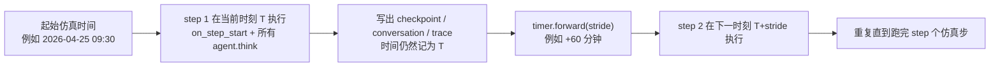
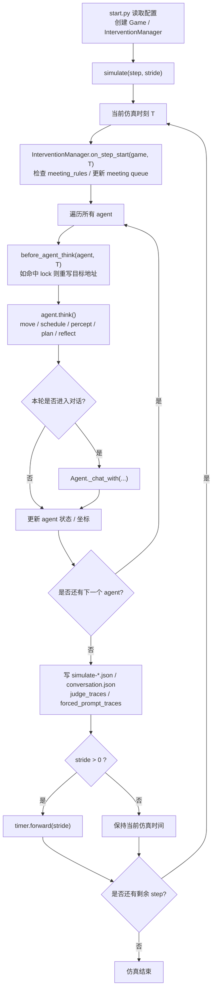
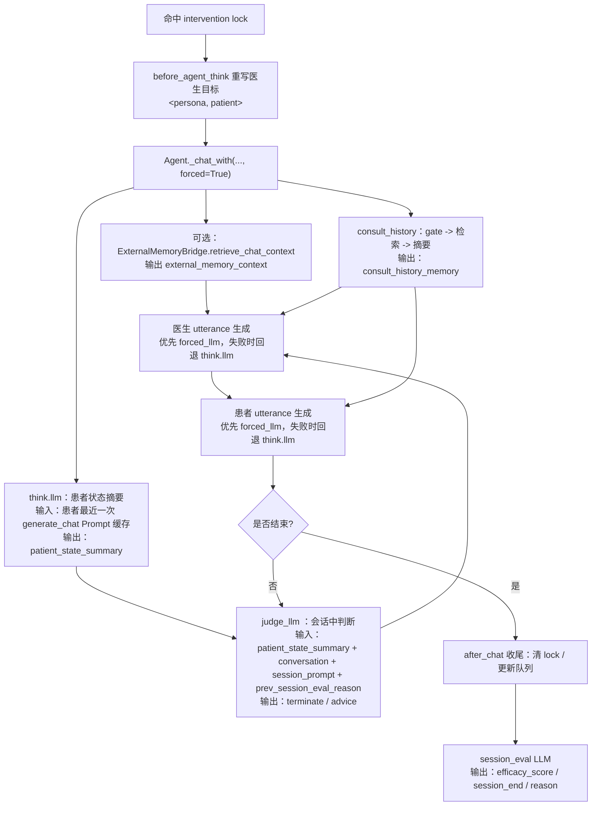
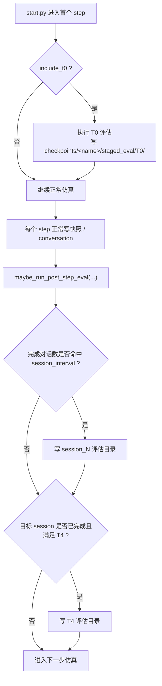

# 基于斯坦福小镇的抑郁症干预仿真系统 GenerativeAgentsCN

> 更新时间：2026-06-04

## 关键测试结果速查

某存档所有结果在`results/experiment_data/xxx`和`results/checkpoints/xxx`目录下，关键测试结果如下：

1. **Prompt使用情况（调用LLM时的Prompt可视化）**：`results/experiment_data/xxx/traces/forced_prompt_traces/`文件夹可以看到所有对话的所有Prompt使用情况，包括患者、判断LLM、医生、评估LLM的Prompt。
   - 作用：最直观观察患者状态变化、各种Prompt使用是否合理。
   - 生成：运行完仿真实验后由 `run_experiment.py` 收集。（另：使用`runshells/run_one_experiment.py`运行仿真实验后自动生成）
2. **仿真内阶段评估（staged_eval）**：`results/checkpoints/xxx/staged_eval/`保存原始阶段评估结果；`results/experiment_data/xxx/scales/staged/`保存收集后的结果与评分文件。
   - 作用：在仿真过程中自动触发 PHQ-9 / BDI-II / SDS 评估，适合做基线、阶段点、结束后一段时间（T4）的纵向对比。
   - 生成：`start.py` 在仿真过程中自动调用 `modules/staged_eval_manager.py` 生成；使用 `runshells/run_one_experiment.py` / `runshells/run_batch_experiment.py` 时会自动收集。
3. app.py评估脚本：`results/experiment_data/xxx/scales`存放了app.py评估脚本的输出结果，包括量表回答、单量表评估和汇总（**scale_scores.json**）。
   - 作用：使用三种自评量表评估患者抑郁程度，包括SDS、BDI-II、PHQ-9。因为上次心理医生反馈说最好就使用自评量表，所以没使用联合量表。
   - 生成：使用`runshells/run_one_experiment.py`运行仿真实验后自动生成
4. 医患对话、判断LLM、会后评估LLM：`results/experiment_data/xxx/traces/merge_consultation_dialogues.json`文件。
   - 作用：可视化所有医患干预对话，包括患者、判断LLM、医生、评估LLM的输出。适合给心理专业人员查看、分析。若 `consult_record.enabled=false`，这里不会额外附带 SOAP 咨询记录。
   - 生成：使用`runshells/run_one_experiment.py`运行仿真实验后自动生成
5. 记忆可视化：`results/experiment_data/xxx/visualizations/agent_memory/memory_view_卡布达_xxx.csv`可以查看某角色的所有记忆
   - 作用：可视化某角色的所有记忆，可以筛选chat记忆查看对话情况、筛选thought记忆查看反思结果、筛选event记忆查看遇到的事件。
   - 生成：使用`runshells/run_one_experiment.py`运行仿真实验后自动生成
6. 外置记忆系统存储情况：`results\external_memory_audit\xxx\report.html`文件。
   - 作用：可视化某存档的所有agent在外置记忆系统中的存储情况，包括记忆数量、记忆层级情况等。
   - 生成：使用`runshells/run_one_experiment.py`运行仿真实验后自动生成

## 更新日志（近期）

以下为 README 内维护的近期更新摘要：

- 2026-06-04：修改`staged_eval`的实施逻辑，从仿真内改成外挂子进程，避免影响仿真实验的内部状态
- 2026-06-03：修改`staged_eval`的判断条件，统一为对话次数。
- 2026-06-03：同步 README，补充`consult_history`（医患历史摘要）与`staged_eval`说明，更新流程图并移除主流程里对`consult_record`的默认启用描述。
- 2026-06-03：瘦身json快照，把`forced_prompt_traces`和`dialog_judge_trace`放到外面json文件了。
- 2026-06-02：新增`staged_eval`的判定条件，走“定期随机居民对话”时按照对话次数累计判断条件，从而触发阶段性评估
- 2026-06-02：修复“定期医患对话”只触发1次的bug，新增“定期随机居民聊天”也能触发staged_eval
- 2026-06-01：优化llm请求机制、实验脚本增加重试机制，当ollama请求卡住时间过长时中断并重新运行。
- 2026-05-31：新增正常/负面聊天提示词前缀（`data/prompts/intervention/resident_chat_neutral_social.txt`和`data/prompts/intervention/resident_chat_negative_support.txt`），结合“定期随机居民聊天”模块使用。
- 2026-05-31：新增定期随机居民聊天功能，复用“定期医患对话”相关功能实现，作为对照组。具体逻辑在`modules/resident_chat_scheduler.py`里。
- 2026-05-30：新增`runshells/run_batch_experiment.py`脚本，用于批量实验。新增`experiment`文件夹存放不同实验组的配置文件。
- 2026-05-30：仿真过程中增加评估环节（与app.py同功能），为了方便实现计划中的“阶段评估”，不需要人工打断再resume。具体逻辑在`modules/staged_eval_manager.py`里
- 2026-05-29：改善聊天没聊到“压力源”问题：新增卡布达初始化记忆注入条数，修改session1的Prompt，删除session_loop配置，给judge-llm总结患者状态时的Prompt中增加压力源约束，给judge-llm提示词增加软约束，**调整患者提示词**`data/prompts/depression/dynamic_prompt_layers.txt`
  - 关于`dynamic_prompt_layers.txt`改造：如果想再收干净一点，下一步可以把 modules/depression/prompt_builder.py:129-163 这段 chain_window_section 的构建也裁掉，但这不是必须项。
- 2026-05-29：修复<患者状态>总结给judge-llm时，因患者Prompt结构更新而引起空缺的问题。增加若干初始记忆注入`data/intervention/memory_injections.json`
- 2026-05-28：合并动态抑郁人设的更新。
- 2026-05-27：修复`customization/depression_scale_agent/ExpertLLM.py `读取api-key的问题。
- 2026-05-26：新增可视化，把“医患对话历史调用模块”中gate_llm和summary_llm输出融进Prompt可视化里
- 2026-05-25：外置记忆服务中，拉长ingest后立马升级L2/里程碑的重试时间，避免服务解析时间太长而超时
- 2026-05-25：修复chat记忆和某些thought记忆重复写入的问题。
- 2026-05-23：修复对比脚本`runshells/run_extra_scale_compare.py`不兼容问题，现在可以指定2个存档的`scales/scale_scores.json`进行量表差异分析对比。
- 2026-05-22：新增医患对话历史调用模块，功能主要是：1. 每次医患对话结束时都会把完整对话记录存到【医患历史对话记忆库】里，并把node方式的chat_summary作为检索向量。2. 医生/患者发言前由gate-llm判断是否需要检索该记忆库，若需要则检索并返回若干个相关的完整对话记录。3. 若需要检索并返回成功，则调用llm进行总结，形成“记忆摘要”。
- 2026-05-22：修复抑郁主诉链只有4个的问题，主要触因是主诉链更新Prompt以及一致性检查函数去除未知id。实验后发现有一些问题，做了二次改造，主要是允许新增多个后续主诉节点（next_chain）的树形结构而非只有1个的线性结构。
- 2026-05-20：修复合并失误的问题，`modules/depression`的代码没问题，但是之前的`agent.py`里没有完全合并学长分支内容。
- 2026-05-19：优化一些Prompt，并且新建`data/prompts/intervention/consultation_memory_summary.txt`专门用于干预对话的“摘要”。
- 2026-05-18：修复`merge_consultation_dialogues.py`脚本依赖`consult_record`配置开启的问题
- 2026-05-17：`config.json`新增配置`agent.associate.recent_dedup_limit`，用于控制event/chat记忆描述相似去重的最近条数范围，设为0时不去重。修复chat记忆的`poignancy`值异常不计入累加而导致thought触发频率下降的问题
- 2026-05-17：根据记忆服务更新，新增2个脚本并优化`visualize_external_memory_audit.py`。新脚本`recheck_memory_embedding_service.py`作用是“调用外置记忆服务的 embedding 重探活接口”，检索服务重启时使用。`inspect_memory_user_stats_by_save.py`作用是查看某存档所有角色记忆总体情况，目前看下来所有记忆在运行期间都是"raw_fallback"状态，后续问问怎么回事。
- 2026-05-16：仿真实验脚本`runshells/run_one_experiment.py`新增可视化本地记忆、外置记忆系统的环节（相当于自动执行`visualize_agent_memory.py`和`visualize_external_memory_audit.py`）
- 2026-05-16：完整删除旧人设系统，现在只有学长的动态抑郁人设
- 2026-05-15：`config.json`新增配置"reflect_focus_topk"和"reflect_insights_topk"，用于控制反思输出数量。同时降低"poignancy_max"数值，避免反思触发间隔太大
- 2026-05-15：新增仿真后量表批量测试、重复测试脚本`runshells/run_extra_scale_eval.py`。设置好量表以及重复次数后运行，在`results/experiment_data/xxx/scales`可以看到单独以及汇总结果。
- 2026-05-15：合并学长更新的动态抑郁人设，并且修复人设读取不成功的潜在问题。
- 2026-05-14：新增测试脚本`test/live_external_memory_retrieve_dump.py`，用于测试外置记忆系统的记忆召回功能。发现问题：无论`query`是什么，外置记忆系统召回的内容完全一样，准备反馈给那边的同学。
- 2026-05-14：合并欧博的脚本功能，并修正为适用于本工作区的版本。另外参照欧博脚本新增了自动化跑一次实验并评估的脚本`runshells/run_one_experiment.py`。（**特殊作用**：可以单独跑一个`step = 1`的结果，用与评估初始化状态的抑郁程度）
- 2026-05-13：重组实验结果目录结构。experiment_data 条件目录增加 configs/traces/scales 子目录；questions/ 拆分为 templates/scoring_prompts/adhoc；experiment_logs 合并到 experiment_data/logs。详见 `counsel_context/实验结果目录重组说明.md`。（来自欧博）
- 2026-05-13：在`readme.md`第五章增加流程图，方便理解流程
- 2026-05-13：新增功能：使用think.llm压缩患者状态信息后再注入给judge-llm，避免信息冗余
- 2026-05-12：新增`scripts\intervention_prompt_txt_sync.py`脚本，方便查看和修改 session Prompt。
- 2026-05-12：根据心理医生反馈调整 CBT session Prompt、judge-llm Prompt 和 session-eval Prompt，主要降低患者表达能力的要求、让session-eval和judge-llm输出更合理。session-eval的Prompt里新增了当前session停留情况，避免长时间停留某个session里
- 2026-05-11：新增3个量表的单独提示词，在app.py中复制到专家模型提示词里。新增3个量表的v2版本，放到`customization\depression_scale_agent\questions`文件夹里。
- 2026-05-10：将"memory_policy"配置落实到app.py中。config.json新增记忆排序权重调整项并落地到快照里。（关于系统自带的记忆系统，与外置记忆系统无关）
- 2026-05-07：可视化Prompt使用后，优化以前 Prompt 注入中的一些问题。
- 2026-05-07：新增可视化强制干预对话时LLM调用的Prompt，包括患者、判断LLM、医生、评估LLM。可视化md文档在`result/checkpoints/xxx/force_prompt_traces`里。注：md文档命名的时间不一定是发生对话的时间。
- 2026-05-07：合并学长更新的主诉链分支。
- 2026-05-06：修复emotion模块在app.py以及仿真链路中未能正常显示的问题，因为emotion模块绑定在了旧人设链路中，待学长修复后再进行二次更新。
- 2026-04-28：手动升级session对话记忆、注入记忆的层级。（0429发现bug，已修复）
  - 相关文件：`data/config.json`、`modules/external_memory_bridge.py`、`modules/memory_injection_manager.py`、`modules/intervention_manager.py`
-
- 2026-04-28：新增删除外置记忆系统中某存档所有agent接口、脚本。【待实验】
  - 相关文件：`cleanup_memory_users_by_save.py`、`modules/ec_doll_memory_service_client.py`、

- 2026-04-26：截断外置记忆系统的【近期原文（本服务入库）】记忆数量（"short_term_recent_n"配置项）、去掉 [2026-04-25Txx:xx:xx] 前缀
  - 相关文件：`modules/external_memory_bridge.py`、`data/config.json`

- 2026-04-26：修复启用外置记忆系统时未能正确注入动态抑郁人设问题（0428发现新bug，已修复）
  - 相关文件：
    - `data/config.json`
    - `data/prompts/generate_chat_external_memory.txt`
    - `modules/agent.py`
    - `modules/external_memory_bridge.py`
    - `modules/prompt/scratch.py`
    - `customization/depression_scale_agent/app.py`

- 2026-04-25：量表评估更新，对齐外置记忆系统
  - 相关文件：`customization\depression_scale_agent\app.py`

- 2026-04-24：强制干预地址语义正常化，修复写入记忆时的地址错误问题
  - 相关文件：`modules/agent.py`

- 2026-04-23：更新外置记忆系统对接、新增可视化脚本
  - 相关文件：`modules/external_memory_bridge.py`、`modules\ec_doll_memory_service_client.py`、`visualize_external_memory_audit.py`

- 2026-04-21：融入赵学长的动态抑郁人设系统、修复兼容bug
  - 相关文件：`analyze_depression_dynamic_state.py`、`modules/depression_dynamic_adapter.py`、`modules/depression/state_machine.py`、`modules/depression/context_analyzer.py`、`modules/depression/engine.py`、`modules/agent.py`、`data/config.json`、`frontend/static/assets/village/agents/卡布达/depression_config.json`

- 2026-04-20：新增会话中判断LLM、会话后评估LLM
  - 相关文件：`modules/intervention_manager.py`、`data/config.json`等

## config.json 推荐配置（当前主线实验）

以下推荐面向当前主线链路：**外置记忆 + 强制干预 + 动态抑郁人设**。真正生效仍以 `data/config.json` 为准；若要排查行为异常，建议优先看这里，再顺着 `start.py -> modules/game.py -> modules/agent.py / modules/intervention_manager.py` 往下追。

```text
data/config.json
├── agent
│   ├── think
│   │   ├── llm -> provider=ollama / model=qwen3:8b-q4_K_M
│   │   ├── poignancy_max -> 30（推荐先保持 20~40；太大反思太少，太小容易过密）
│   │   ├── reflect_focus_topk -> 4（推荐 3~5）
│   │   └── reflect_insights_topk -> 1（推荐先保持 1）
│   ├── associate
│   │   ├── embedding -> provider=ollama / model=bge-m3:lates
│   │   ├── recent_dedup_limit -> 0（0=不去重；控制event/chat记忆描述去重）
│   └── external_memory
│       ├── enabled -> true（开启外置记忆系统）
│       ├── short_term_recent_n -> 20（控制近期记忆数量）
│       └── updata_to_milestone_apply_scenes -> ["session2.3_completed", "session3.3-A_completed", "session4.2_completed"]（哪些session对话记忆升级L2）
├── intervention
    ├── enabled -> true
    ├── doctor -> 蜻蜓队长
    ├── patients -> [卡布达, 金龟次郎]（后者暂时无设置人设）
    ├── meeting_rules
    │   ├── 推荐：同一轮实验只启用 1 条规则，避免会诊频率叠加
    │   └── 当前启用：fast_every_4step（卡布达）；其他规则按需单独切换
    ├── order_extract.enabled -> true（后续可能删除医嘱提取功能，没什么用感觉）
    ├── session_prompt_injection
    │   ├── enabled -> true
    │   └── namespace -> CBT
    ├── chat_controls
    │   ├── enabled -> true
    │   └── agent_overrides[*]
    │       ├── forced_chat_iter -> 18（控制发言次数上限）
    │       └── forced_chat_min_turns -> 2
    ├── forced_llm
    │   ├── enabled -> true
    │   ├── model -> deepseek-v4-flash
    │   ├── api_key_env -> DEEPSEEK_API_KEY
    │   └── temperature -> 0.5（推荐 0.3~0.7）
    ├── dialog_judge
    │   ├── enabled -> true
    │   ├── force_forced_llm -> true
    │   └── patient_state_summary_retry -> 2
    ├── session_eval
    │   ├── enabled -> true
    │   ├── route -> forced_llm
    │   └── history_recent_n -> 3
    ├── consult_history
    │   ├── enabled -> true（当前主线医患对话建议开启）
    │   ├── retrieve_top_k -> 3
    │   └── summary_route -> forced_llm
    ├── consult_record.enabled -> false（咨询记录模块，感觉没什么用暂时关闭了）
    ├── depression_dynamic
    │   ├── enabled -> true（当前主线建议开启）
    │   └── target_hints -> （详情看config.json，人设使用范围）
    ├── memory_injection.enabled -> true（记忆注入功能）
    └── memory_policy.enabled -> true（使用了小镇自带记忆系统，不用理会）
└── staged_eval
    ├── enabled -> true（仿真内自动量表评估）
    ├── include_t0 -> true（初始基线）
    ├── session_interval -> 2（每完成 2 次对话触发一次阶段评估）
    ├── t4_enabled -> true（治疗结束后延迟观察点）
    └── max_completed_sessions -> 10（阶段评估最多统计到第 10 次完成对话）
```

补充说明：

- 若你本地分支仍保留 `intervention.depression_update` 旧配置，建议继续保持 `enabled=false`，不要与 `depression_dynamic` 同时启用。
- `doctor`、`patients`、`meeting_rules[*].doctor/patient`、`chat_controls.agent_overrides` 里的角色名必须完全一致。
- 推荐先确认 `external_memory`、`forced_llm`、`dialog_judge`、`consult_history`、`session_eval`、`depression_dynamic` 这 6 条链路都通；若要做评估实验，再额外确认 `staged_eval` 触发是否符合预期。

## 1. 项目简介

本项目是一个多智能体仿真系统，在常规行为仿真基础上，扩展了医患场景中的干预会话能力，重点包含：

- 会诊调度与强制会话（Intervention）
- 会话判定与终止检测（Dialog Judge）
- 医患历史检索与摘要（Consult History）
- 会后评估与阶段评估（Session Eval / Staged Eval）
- 本地记忆与外置记忆协同（External Memory）
- 抑郁动态链路（Depression Dynamic）

注意：该项目用于技术与研究场景，不构成医疗建议。

## 2. 代码目录结构

| 路径           | 说明                                                              |
| -------------- | ----------------------------------------------------------------- |
| `start.py`     | 仿真主入口（按 step 推进，写 checkpoint 与对话日志）              |
| `compress.py`  | 将 checkpoint 压缩为回放数据（`movement.json`、`simulation.md`）  |
| `replay.py`    | 回放 Web 服务入口（Flask）                                        |
| `runshells/`   | 单次实验、批量实验、量表补跑与结果后处理脚本                      |
| `experiments/` | 分组实验 overlay 配置（如 g1/g2/g3/g5）                           |
| `modules/`     | 核心逻辑模块（agent、intervention、memory、depression 等）        |
| `data/`        | 配置与提示词（`data/config.json`、`data/prompts/...`）            |
| `frontend/`    | 回放前端资源与静态资产、动态抑郁人设`depression_config.json`      |
| `results/`     | 仿真输出目录（`checkpoints/`、`experiment_data/`、`compressed/`） |

## 3. 快速使用说明

## 3.1 环境准备

- 建议 Python 3.10+。
- 根目录当前未维护统一 `requirements.txt`；请使用项目现有可运行环境。
- 若新环境首次运行，按报错安装依赖（常见：`flask`、`python-dotenv`、`requests`）。
- 在当前目录下新建`.env`文件，配置deepseek api key，格式为`DEEPSEEK_API_KEY=sk-xxxx`

## 3.2 启动仿真

```bash
python start.py --name sim-xxx --step 10 --stride 60 --verbose info --log sim-xxx.log
# 例如
python start.py --name sim-test-0425 --step 48 --stride 60 --start 20260425-09:30 --verbose info --log sim-test-0425.log
# 断链重跑
python start.py --name sim-test-0425 --resume --step 12 --stride 60 --verbose info --log sim-test-0425-resume-1.log
```

常用参数：

- `--name`：本次仿真名称（用于结果目录命名）
- `--step`：本次推进步数
- `--stride`：每步对应的分钟数
- `--resume`：从已有同名 checkpoint 继续跑
- `--verbose`：日志级别（`info`、`debug`），新功能增加时没留意这个`debug`模式，不知道有没有用
- `--log`：日志文件名称，在`results/<name>/`目录下，默认`results/<name>/sim-xxx.log`

## 3.3 生成回放数据

```bash
python compress.py --name sim-xxx
```

## 3.4 启动回放页面

```bash
python replay.py
```

浏览器访问：

```text
http://127.0.0.1:5051/?name=sim-xxx
```

## 3.5 抑郁量表评估（app.py）

使用 Gradio 界面让仿真中的患者 agent 回答量表题目，再由专家模型进行评分评估。

### 启动

```bash
conda activate generative_agents_py310
python -u customization/depression_scale_agent/app.py
```

启动后在终端输出中找到地址（如 `http://127.0.0.1:7860/`），在浏览器中打开。首次加载存档较慢，请耐心等待。

### 操作流程

1. **选择存档与快照**：在界面顶部选择要评估的模拟存档和配置快照（默认选最后一个快照，即治疗后状态）
2. **选择角色**：选择需要评估的患者角色
3. **选择量表问卷**：在"选择 jsonl 文件"下拉框中选择量表文件，可用的量表包括：
   - `PHQ-9.jsonl` / `PHQ-9-v2.jsonl`
   - `BDI-II.jsonl` / `BDI-II-v2.jsonl`
   - `SDS.jsonl` / `SDS-v2.jsonl`
4. **批量问答**：点击"开始批量问答"按钮，等待逐题完成。完成后可下载 `*_answered.jsonl` 文件，同时生成 `*_prompt_trace.json` 和 `*_prompt_trace.md`（患者完整注入 Prompt 追踪）
5. **专家模型评估**：
   - 打开 `customization/depression_scale_agent/questions/scoring_prompts/` 目录下对应量表的评估提示词（如 `PHQ-9评估提示词.md`、`BDI-II评估提示词.md`、`SDS评估提示词.md`）
   - 将评估提示词复制到界面的"System Prompt"输入框中
   - 点击"调用专家模型"，等待输出评估结果
   - 将输出复制到新建文件中保存，作为专家评估分析

### 输出文件

所有输出位于 `customization/depression_scale_agent/questions/adhoc/` 目录：

| 文件                           | 说明                                       |
| ------------------------------ | ------------------------------------------ |
| `*_answered.jsonl`             | 量表问答结果（每题问题 + 回答）            |
| `*_answered_prompt_trace.json` | 完整 Prompt 注入追踪（JSON）               |
| `*_answered_prompt_trace.md`   | 完整 Prompt 注入追踪（Markdown，可读性好） |

这条链路适合做“手动指定存档 / 快照”的单次评估；如果要看仿真过程中的自动阶段评估，见下方 `staged_eval`。

## 3.6 批量实验与仿真内自动评估

### `runshells/run_batch_experiment.py` 在做什么

这个脚本面向“按实验组批量跑仿真并自动汇总评估结果”的场景，主流程是：

1. 根据 `group × severity` 组合替换配置。
2. 逐条件调用 `start.py` 跑仿真。
3. 收集 `judge_conversation.json`、`forced_prompt_traces/`、`conversation.json`、`staged_eval/` 等核心产物。
4. 对 `scales/staged/` 下的阶段评估结果自动补齐评分文件。
5. 汇总到 `results/experiment_data/reports/*_summary.json` 和 `*_summary.md`。

直接运行：

```bash
python3 runshells/run_batch_experiment.py
```

常见筛选方式：

```bash
python3 runshells/run_batch_experiment.py --condition Counsel-G1-MILD
python3 runshells/run_batch_experiment.py --condition Counsel-G1-ALL
python3 runshells/run_batch_experiment.py --condition Counsel-ALL-MOD
```

脚本顶部常量可以直接改当前批次的 `RUN_NAME`、`STEP`、`STRIDE`、`SCALE_AGENT`，以及是否执行 `merge`、`post_scale`、`compress`、记忆可视化、外置记忆审计。

### `staged_eval` 是怎么触发的

- `start.py` 在首个 step 内先调用 `StagedEvalManager.maybe_run_t0(...)`，用于生成初始基线评估（`T0`）。
- 每个 step 写完快照与对话后，再调用 `maybe_run_post_step_eval(...)` 检查是否触发阶段评估。
- 当完成对话次数命中 `session_interval` 倍数时，会生成 `session_2`、`session_4` 这类阶段点。
- `session_N` 仍然沿用历史目录命名，但这里的 `N` 现在表示“第 N 次完成对话”。
- 当目标医患 session 全部完成后，若开启 `t4_enabled`，会在 `t4_after_steps` 个仿真步之后再补一个 `T4` 观察点。

阶段评估原始文件位于：

- `results/checkpoints/<name>/staged_eval/<trigger>/`

收集后的实验目录位于：

- `results/experiment_data/<name>/scales/staged/<trigger>/`

每个 trigger 目录下通常包含：

- `{SCALE}_answered.jsonl`：量表逐题回答
- `{SCALE}_trace.json`：逐题回答时的 trace
- `metadata.json`：触发标签、完成 session 数、快照名、仿真时间等元信息

## 3.7 结果目录

### results/checkpoints/（仿真原始产物）

start.py 直接输出的仿真数据：

- `results/checkpoints/<name>/simulate-*.json`：每步快照
- `results/checkpoints/<name>/conversation.json`：所有对话记录
- `results/checkpoints/<name>/consult_history/`：医患历史对话记忆库与检索索引
- `results/checkpoints/<name>/staged_eval/`：仿真内自动阶段评估原始结果
- `results/checkpoints/<name>/storage/`：agent 向量存储

### results/experiment_data/（实验分析产物）

由 `run_experiment.py` / `runshells/run_one_experiment.py` / `runshells/run_batch_experiment.py` 收集和分析的实验数据：

- `results/experiment_data/<name>/configs/`：实验输入配置（`original_agent.json`、`original_config.json`、`original_depression_config.json`）
- `results/experiment_data/<name>/traces/`：仿真后处理产物
  - `judge_conversation.json`：[患者-判断LLM-医生] + 评估LLM 输出
  - `forced_prompt_traces/`：每次干预的完整 Prompt 追踪；若开启 `consult_history`，其中会包含 gate / summary 的提示词与输出
  - `merge_consultation_dialogues.json`：合并对话结果；仅在 `consult_record.enabled=true` 时额外附带咨询记录
- `results/experiment_data/<name>/scales/`：量表评估数据
  - `staged/<trigger>/`：仿真内自动阶段评估（如 `T0`、`session_2`、`T4`）
  - `{SCALE}_{phase}_answered.jsonl`：量表问答结果
  - `{SCALE}_{phase}_scored.json`：量表评分结果
  - `scale_scores.json`：汇总评分
  - `expert/`：专家 LLM 评估分析
- `results/experiment_data/<name>/trial_meta.json`：试验元数据
- `results/experiment_data/reports/`：实验报告
  - `analysis_report.md`：综合分析报告
  - `analysis_report_appendix.md`：报告附录（量表问答原始记录）
- `results/experiment_data/logs/`：实验运行日志

### results/compressed/

- `results/compressed/<name>/`：回放资源（`movement.json`、`simulation.md`）

### customization/depression_scale_agent/questions/

- `questions/templates/`：量表题目定义（`.jsonl`，只读输入）
- `questions/scoring_prompts/`：评分提示词（`*评估提示词.md`，只读输入）
- `questions/adhoc/`：app.py 临时评估输出（`*_answered.jsonl`、`*_prompt_trace.*`）

## 4. data/config.json 模块配置

下面给出与上方“config.json 推荐配置（当前主线实验）”一致的快速索引；更细的推荐值和当前启用状态，优先以上面的配置树与 `data/config.json` 为准。

## 4.1 agent 配置

- `think.llm`、`associate.embedding`：当前主线实验默认都走本地 `ollama`
- `agent.think.poignancy_max`：反思触发阈值；当前为 `30`，一般建议先在 `20~40` 内调
- `agent.think.reflect_focus_topk` / `reflect_insights_topk`：控制反思输出数量；当前分别为 `4` / `1`
- `agent.associate.recent_dedup_limit`：event/chat 记忆近期相似去重范围；`0` 表示不去重，当前为 `32`
- `agent.associate.chat_retrieve.similarity_top_k`：本地语义检索条数；当前为 `6`
- `agent.external_memory`：当前主线建议开启
  - `enabled=true`
  - `read_mode=chat_only`：只在强制干预对话中检索外置记忆
  - `fallback_to_local=true`：外置记忆服务异常时回退本地记忆
  - `short_term_recent_n=20`：近期原文注入数量，建议先在 `10~30` 内调
- `chat_history` / `chat_memory`：仍保留在旧链路里，但通常不是当前主线实验的首要调参点

## 4.2 intervention 配置

- `enabled`：开启强制干预主链路
- `doctor` / `patients`：医患角色定义
- `meeting_queue.enabled`：建议保持开启，避免同一医生的会诊调度混乱
- `meeting_rules`：会诊触发规则
  - 推荐一次实验只启用 **1 条** 规则，避免频率叠加
  - 当前主线启用的是 `fast_every_4step`（卡布达）；其他规则默认关闭，按需单独切换
- `order_extract.enabled`：当前为 `true`；若本轮不分析医嘱，可临时关闭
- `session_prompt_injection`：治疗 Prompt 注入链路，当前主线保持开启，`namespace=CBT`
- `chat_controls`：强制对话轮次控制
  - 当前采用 `defaults.enabled=false + agent_overrides.enabled=true` 的方式
  - `forced_chat_iter=18`：当前每个相关角色都按 override 单独控制
- `forced_llm`：强制干预对话模型；当前为 `deepseek-v4-flash`，需在 `.env` 配置 `DEEPSEEK_API_KEY`
- `dialog_judge`：会话中判断 LLM；当前保持 `enabled=true` 且 `force_forced_llm=true`
- `session_eval`：会话后评估 LLM；当前 `route=forced_llm`，`history_recent_n=3`
- `consult_history`：医患历史摘要模块；通过 gate 判断是否检索历史对话，再把检索命中的完整对话总结成 `consult_history_memory` 注入当前回复
- `consult_record`：咨询记录生成；当前主线为 `enabled=false`，要看 SOAP 记录时再开启
- `depression_dynamic`：动态抑郁人设主链路；当前主线建议保持 `enabled=true`
  - `normal_chain_enabled=true`
  - `forced_chain_enabled=true`
  - `prompt_injection_enabled=true`
  - `event_commit_enabled=true`
  - 角色侧配置见 `frontend/static/assets/village/agents/卡布达/depression_config.json`
- `memory_injection`：记忆注入规则，当前启用了初始化注入和指定 session 完成后的注入
- `memory_policy`：强制对话阶段的检索权重策略；当前主线保持开启

## 4.3 配置注意事项

- `doctor`、`patients`、`meeting_rules[*].doctor/patient`、`chat_controls.agent_overrides` 里的角色名必须完全一致。
- `session_prompt_injection.order` 必须与提示词文件中的 session id 对齐。
- 若本地分支仍保留 `intervention.depression_update` 旧配置，建议继续保持 `enabled=false`，不要与 `depression_dynamic` 同时启用。
- 若启用外置记忆，请确认 `agent.external_memory.base_url` 可访问，且服务端接口就绪；可运行 `test/live_ec_doll_memory_service_health_ready.py` 检查。
- `staged_eval` 的阶段触发现在统一按“完成对话次数”累计；`session_N` 只是历史命名，不再表示 CBT session 数。
- 建议优先确认 `external_memory`、`forced_llm`、`dialog_judge`、`consult_history`、`session_eval`、`depression_dynamic` 这 6 条链路都正常，再去微调 `meeting_rules`、`chat_controls`、`recent_dedup_limit` 等细项。

## 4.4 staged_eval 配置

- `enabled`：是否开启仿真内自动阶段评估
- `target_agent`：被评估的患者角色
- `include_t0`：是否在首个 step 生成基线评估 `T0`
- `session_interval`：每完成多少次对话，触发一次阶段评估
- `max_completed_sessions`：阶段评估最多统计到多少次完成对话数
- `t4_enabled`：是否在治疗完成后再补一个延迟观察点 `T4`
- `t4_after_steps`：治疗完成后再等待多少个 step 触发 `T4`
- `scales`：当前要跑的量表，默认是 `PHQ-9`、`BDI-II`、`SDS`

## 5. 运行流程图总览

下面用“时间推进 -> 整体主循环 -> 强制干预对话中的 LLM 协作 -> 仿真内自动评估”四个视角说明当前工作区的核心流程。

### 5.1 step / stride 的时间流逝机制

- `step`：本次 `simulate()` 要执行多少个“离散仿真步”。
- `stride`：每个 step 结束后，仿真时间统一向前推进多少分钟。
- 一个 step 内，所有 agent 都共享同一个仿真时刻 `T`；不会在 agent 之间单独推进时间。
- 每个 step 的顺序是：**在当前时刻 `T` 完成调度与所有 agent 行为 -> 写 checkpoint / conversation / judge trace -> 最后再 `forward(stride)`**。
- 因此，相邻两个 checkpoint 的时间差通常就是 `stride`。例如：`step=48, stride=60` 表示连续跑 48 个仿真步，每步代表 60 分钟仿真时间。
- `resume` 时，会读取最近一次 checkpoint 的时间，并在此基础上再加一个 `stride` 作为下一步起点。



### 5.2 整体主流程



可以把它理解为：**每个 step 先做完整轮业务，再统一推进一次仿真时间**。

### 5.3 强制干预对话期间，哪些 LLM / 模块在工作

这里的“强制干预对话”是指：命中 `intervention lock` 后，`before_agent_think(...)` 会把医生当前行动目标重写为 `<persona, patient>`，随后进入 `Agent._chat_with(..., forced=True)`。



#### 5.3.1 强制对话里的 LLM 分工速查

| 环节                                  | 主要模型路由                                                      | 主要输入                                                                                                                                       | 主要输出 / 作用                           |
| ------------------------------------- | ----------------------------------------------------------------- | ---------------------------------------------------------------------------------------------------------------------------------------------- | ----------------------------------------- |
| 患者状态摘要                          | 医生侧 `think.llm`                                                | 患者最近一次 `generate_chat` Prompt 缓存中的动态状态文本                                                                                       | 给 judge 用的 `patient_state_summary`     |
| 会话中判断 `dialog_judge`             | `forced_llm`                                                      | `patient_state_summary`、当前对话历史、当前 session prompt、上一次 session eval reason                                                         | `terminate`、`advice`                     |
| 医患历史摘要 `consult_history`        | gate 默认走 `forced_llm`；summary 由 `summary_route` 决定         | 最新一轮对方发言、当前对话历史、命中的历史完整对话记录                                                                                         | `consult_history_memory`                  |
| 医生回复生成 `generate_chat`          | 强制链路里**优先** `forced_llm`，失败则回退医生自己的 `think.llm` | relation、chats、医生 session prompt、consult record 注入、judge advice、depression block、`external_memory_context`、`consult_history_memory` | 医生自然语言回复                          |
| 患者回复生成 `generate_chat`          | 强制链路里**优先** `forced_llm`，失败则回退患者自己的 `think.llm` | relation、chats、depression block、`external_memory_context`、`consult_history_memory`                                                         | 患者自然语言回复                          |
| 复读检测 `generate_chat_check_repeat` | 与 `Agent.completion(...)` 相同的强制路由规则                     | 当前对话历史、当前轮回复                                                                                                                       | 是否出现复读，用于提前结束                |
| 终止检测 `decide_chat_terminate`      | 仅在未启用 `dialog_judge` 时参与；同样优先 `forced_llm`           | 当前对话历史                                                                                                                                   | 是否结束对话                              |
| 会后评估 `session_eval`               | 由 `session_eval.route` 决定：`forced_llm` 或 `think_llm`         | session prompt、历史 eval reason、usage log、完整对话                                                                                          | `efficacy_score`、`session_end`、`reason` |

#### 5.3.2 关于模型路由，最容易混淆的点

- `Agent.completion(...)` 在 `forced=True` 的上下文里，不只是 `generate_chat`，很多 agent 侧 Prompt（例如 `summarize_relation`、`generate_chat_check_repeat`、`summarize_chats`，以及在关闭 `dialog_judge` 时的 `decide_chat_terminate`）都会**先尝试走 `intervention.forced_llm`**。
- `consult_history` 不是每轮必跑：当前要求模块开启、角色能解析成医患对、`turn_no > 1`，并且 gate 判断 `need_retrieval=true` 后才会继续检索和摘要。
- 是否真的走 `forced_llm`，要同时满足：
  - `intervention.forced_llm.enabled = true`
  - 当前确实是医生-患者配对
  - 双方 lock 都有效，且 `meeting_id` 一致
  - 对应 API key 已配置
- 如果强制路由不可用或调用失败，agent 侧生成会回退到该角色自己的 `think.llm`。
- `ExternalMemoryBridge.retrieve_chat_context(...)` 本身不是这里的一次 LLM 调用，但它会在回复生成前产出 `external_memory_context`，直接影响后续 `generate_chat` 的输入。

配置与链路映射速查：

- 调度阶段：`meeting_rules`
- 强制对话阶段：`chat_controls` / `forced_llm` / `dialog_judge` / `consult_history`
- 会后阶段：`session_eval` / `memory_injection` / `depression_dynamic` / `consult_record`（可选，默认关闭）

### 5.4 仿真内自动评估（staged_eval）

`staged_eval` 不依赖人工暂停仿真。`start.py` 会在仿真过程中自动检查触发条件，并把每个评估点单独落盘。



常见 trigger 含义：

- `T0`：初始基线
- `session_2` / `session_4`：阶段性评估点（历史命名，对应第 2 / 4 次完成对话）
- `T4`：治疗结束后一段时间的延迟观察点

## 6. 运行结果与回放

## 6.1 关键输出文件

- `results/checkpoints/<name>/`：仿真原始产物（快照、对话记录、storage）
- `results/checkpoints/<name>/consult_history/`：医患历史对话记忆库与索引
- `results/checkpoints/<name>/staged_eval/`：仿真内自动阶段评估原始结果
- `results/experiment_data/<name>/configs/`：实验输入配置
- `results/experiment_data/<name>/traces/judge_conversation.json`：[患者-判断LLM-医生] + 评估LLM 的输出结果
- `results/experiment_data/<name>/traces/forced_prompt_traces/`：每次干预的完整 Prompt 追踪
- `results/experiment_data/<name>/traces/merge_consultation_dialogues.json`：合并对话及咨询记录（需运行 `merge_consultation_dialogues.py`）
- `results/experiment_data/<name>/scales/`：量表评估问答、评分、专家分析；其中 `scales/staged/` 是仿真内自动评估
- `results/experiment_data/reports/analysis_report.md`：综合分析报告
- `results/experiment_data/reports/*_summary.{json,md}`：批量实验的汇总结果
- `results/compressed/<name>/`：回放资源（`movement.json`、`simulation.md`）

## 6.2 conversation.json 说明

- 记录每个仿真时刻发生的会话内容。
- 常用于排查“某一步是否发生对话、对话文本是什么、谁与谁在说话”。

## 6.3 judge_conversation.json 说明

- 位于 `judge_traces/` 目录，由仿真过程自动写出
- 用于审计强制会话中`会话中判断LLM`以及`会话后评估LLM`的输出

## 6.4 visualize_agent_memory.py 作用

该脚本用于离线可视化某个角色的记忆数据（`event/thought/chat`）：

- 读取来源：
  - 快照文件（`simulate-*.json`）中的 memory 引用
  - `storage/<agent>/associate/docstore.json`
  - `storage/<agent>/associate/default__vector_store.json`
- 输出产物：
  - `memory_visualization/*.json`
  - `memory_visualization/*.csv`
  - `memory_visualization/*.html`

基本使用方式：

1. 编辑 `visualize_agent_memory.py` 顶部配置区（`CHECKPOINT_DIR`、`SNAPSHOT_FILE`、`AGENT_NAME`）。
2. 运行：

```bash
python visualize_agent_memory.py
```

## 6.5 visualize_external_memory_audit.py 作用

该脚本用于审计外置记忆系统的调用情况、可视化某个角色的记忆数据

- 输出产物：
  - `memories.csv`
  - `relations.csv`
  - `report.html`
  - `report.json`
  - `timeline.csv`
    基本使用方式：基本同上

## 6.6 merge_consultation_dialogues.py 作用

该脚本用于将强制会话相关的对话以及中间产物进行合并，输出到一个文件中，方便查看和分析。

- 输出产物：
  - `merge_consultation_dialogues.json`
- 补充说明：
  - 默认主线里 `consult_record=false`，因此合并结果主要包含患者、判断LLM、医生、会后评估理由。
  - 若显式开启 `consult_record`，则会额外合并 SOAP 结构化咨询记录。
- 基本使用方式：基本同上
-

## 6.7 analyze_depression_dynamic_state.py 作用

该脚本用于分析动态抑郁人设系统的状态变化情况，输出每个step的状态数据，方便查看和分析。(具体由赵学长更新)

## 6.8 cleanup_memory_users_by_save.py作用

该脚本用于删除外置记忆系统中某个存档下的所有agent数据，避免外置记忆系统的数据冗余。

## 7. 常见问题与排障

## 7.1 仿真名称冲突 / 恢复失败

- 新建仿真时名称**已存在**会被要求重输。
- resume模式下若找不到对应目录，会提示目录不存在。
- 建议先检查 `results/checkpoints/<name>/` 是否存在。

## 7.2 回放提示缺少 movement.json

- 说明还未执行压缩步骤。
- 先运行 `python compress.py --name <name>`，再访问 replay 页面。

## 7.3 强制会诊未触发

重点检查：

- `intervention.enabled` 是否开启
- `meeting_rules` 是否有 `enabled=true` 且触发条件匹配当前 step/time
- `doctor/patient` 名称是否与角色配置一致

## 7.4 外置记忆是否生效

重点检查：

- `agent.external_memory.enabled=true`
- `base_url` 可访问
- 日志中是否出现 `[EXT_MEMORY_RETRIEVE]` 与 `[EXT_MEMORY_CHAT_ROUTE] route=external`
- 运行`test\live_ec_doll_memory_service_health_ready.py`检查

## 7.5 日志定位建议

- 对话内容：`conversation.json`
- 判定轨迹：`judge_traces/judge_conversation.json`
- 全链路审计：`results/checkpoints/<name>/<name>.log`
- 外置记忆审核：`results/external_memory_audit/<name>/`
- 强制干预会话对话记录及中间产物：`results/experiment_data/<name>/traces/merge_consultation_dialogues.json`

## 8. 维护约定（建议）

- 每次改动 `intervention` 或 `config`，同步更新 README 的“更新日志（近期）”。
- 新增配置项时，在 README 中补“作用 + 关键参数 + 风险提示”。
- 不在 README 示例中写真实密钥、令牌、私有地址。
