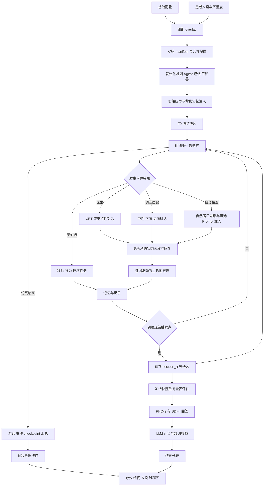
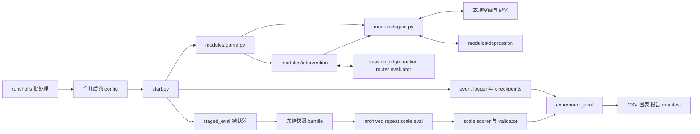

# 抑郁 Agent 仿真小镇：方法与实验框架总览

> 核对基线：2026-08-23。本文以当前工作区的入口、配置、Prompt、实验脚本和结果接口为准；旧文档只用于定位，不作为事实来源。未能由代码或存档确认的内容统一标为“待确认”。

## 1. 研究目标与阅读导航

本项目用一个可持续运行的虚拟小镇研究：具有抑郁背景和动态心理状态的 Agent，在日常生活、自然社交、支持性交流或 CBT 医生干预下，如何表现出不同的对话过程、心理状态变化和量表轨迹。它不是临床诊断系统；当前得到的是 **in-silico（仿真内）证据**，重点是可控条件下的方法比较、机制观察和可重复测量。

建议按以下顺序阅读：

1. 本文：掌握全局流程和边界；
2. [实验条件](01_experimental_conditions.md)：理解 G1–G12 中当前真正启用的组；
3. [动态抑郁人设](02_depression_persona.md)：理解患者“长期背景 + 动态状态”；
4. [CBT 流程](03_cbt_pipeline.md)：理解医生如何观察、选择策略并推进治疗；
5. [评估](04_evaluation.md)：理解 PHQ-9、BDI-II 与重复测量；
6. [结果与图表](05_results_and_figures.md)：理解现有存档能回答哪些问题；
7. [代码映射与维护](06_code_mapping_and_maintenance.md)：以后代码变更时同步更新文档。

## 2. 系统组成

| 层次 | 为什么存在 | 主要输入 | 核心处理 | 主要输出 |
|---|---|---|---|---|
| 小镇运行时 | 给 Agent 提供时间、空间、日程和可感知事件 | 地图、角色配置、步长、当前时间 | 感知、关联记忆、计划、移动、对话、反思 | Agent 状态、事件、对话、本地记忆 |
| 动态抑郁人设 | 避免患者只靠一段静态人设回答 | 长期背景、根主诉、当前阶段、场景、记忆、对话 | 情境分析、即时情绪推断、回复提示构建、证据驱动阶段转移 | 患者回复、阶段历史、转移轨迹 |
| 干预控制 | 在可控时间安排医生或居民接触 | 组别覆盖配置、会议规则、Prompt | 强制会面、自然对话注入、CBT 策略控制、会后判定 | 对话、疗程推进、环境任务、干预日志 |
| 量表评估 | 在相同状态快照上测量症状并估计测量波动 | 冻结快照、PHQ-9/BDI-II 模板 | 逐题作答、LLM 计分、规则校验、重复评估 | 题目分、总分、严重度、可靠性指标 |
| 实验与统计 | 比较组别、人设、严重度和重复运行 | 配置组合、归档、评估结果、事件日志 | 汇总、效应量、轨迹、可靠性、一致性、过程分析 | 表格、图、manifest、报告 |

当前默认模型路由是 OpenAI-compatible 的本地/服务化接口：对话模型默认指向 Qwen3-8B vLLM，Embedding 默认 BGE-M3，部分强制判断与治疗控制使用 DeepSeek 配置。模型名称、端口和路由都属于运行配置，不应写死为方法永恒组成。

## 3. 从初始化到结果分析的完整流程

1. **生成实验条件**：批处理脚本把 `data/config.json` 与组别 overlay、患者 persona、严重度配置合并，并记录运行 manifest 与配置摘要。
2. **初始化小镇**：`start.py` 创建地图、Agent、记忆、动态抑郁引擎、干预管理器、分阶段评估器和事件记录器。
3. **注入初始背景**：干预管理器可把压力源/里程碑写入患者记忆。默认 T0 快照发生在首次 `think` 前，但在这次初始化注入之后。
4. **Agent 生活循环**：每个时间步中，Agent 刷新日程，感知附近事件，检索关联记忆，决定移动、行动、对话或等待，并在周期性/条件性触发点反思。
5. **对话与干预**：组别决定接触来自医生、被调度的居民，还是自然发生的居民对话。CBT 组还会注入当前 session 的治疗目标，并在每轮/会后运行控制判定。
6. **患者动态变化**：患者回复前读取长期人设、当前主诉阶段、场景和即时情绪；回复后只用可观察到的新证据决定是否生成候选节点并推进主诉图。
7. **状态与记录落盘**：对话、Agent 快照、干预日志、判断轨迹、动态人设 LLM 轨迹和 checkpoint 写入运行目录。
8. **分阶段冻结**：T0 以及指定暴露次数/步数保存完整快照。默认是 `capture_only`，即仿真中只冻结状态，不立即完成量表作答。
9. **冻结快照重复评估**：独立脚本对同一快照重复运行 PHQ-9、BDI-II，以区分测量随机性与独立仿真运行差异。
10. **计分与统计**：LLM 将回答映射到 0–3 分，规则程序复核题数、范围、求和和严重度，再由 `experiment_eval` 生成疗效、组间、可靠性、跨量表和过程图表。

## 4. 当前实验条件总览

主批处理脚本当前注册 10 个组别：`G1、G2、G3、G5、G6、G7、G9、G10、G11、G12`。`G4` 没有对应主组 overlay，而是咨询室精简场景，历史结果把它命名为 G4；因此它更适合被视为**场景/运行设置条件**，而不是与其余组完全同构的干预组。

| 条件 | 当前含义 | 接触来源 | CBT 正式流程 |
|---|---|---|---|
| G1 | 医生 CBT | 定时医生会面 | 是 |
| G2 | 无干预 | 小镇自然运行 | 否 |
| G3 | 中性居民对话 | 定时随机居民 | 否 |
| G5 | 负向居民对话 | 定时随机居民 | 否 |
| G6 | 支持性医生交流 | 定时医生会面 | 否，不推进 CBT session |
| G7 | 去记忆写入的 CBT 消融 | 定时医生会面 | 是，但目标患者的主要记忆写入被阻断 |
| G9 | 正向居民对话 | 定时随机居民 | 否 |
| G10 | 自然中性居民对话 | 自然相遇 | 否 |
| G11 | 自然负向居民对话 | 自然相遇 | 否 |
| G12 | 自然正向居民对话 | 自然相遇 | 否 |
| G4 | 咨询室精简设置 | 两角色咨询室 | 通常沿用所选医生控制器 |

组别的精确定义、哪些变量没有保持一致以及 9 人设 × 3 严重度的组合方式见[实验条件](01_experimental_conditions.md)。当前代码可以解析主组的 `9 × 10 × 3 = 270` 个配置组合，但这不代表现有结果已经覆盖全部组合。

## 5. 调用关系和数据流

最关键的状态边界如下：

- **通用 Agent 状态**：位置、日程、局部记忆、对话和反思，负责“小镇生活”。
- **动态抑郁状态**：根主诉锚点、当前主诉阶段、候选转移和即时情绪，负责“患者如何回答与变化”。
- **CBT 治疗状态**：当前固定治疗 session、观察状态、策略、子目标进度，负责“医生如何治疗”。
- **评估快照状态**：冻结以上运行时数据，负责“在同一状态上重复测量”。

代码里都可能出现 `state` 或 `stage`，但这四类状态不能混用。尤其是 CBT 的 `current_session`、动态人设的 `current_stage_id`、Progressive D 的 macro stage/子目标不是同一概念。

## 6. 当前默认运行口径

- 仿真默认批处理为 120 个 step、每步跨越 720 分钟；shell 工作流常把仿真目标设为 72 step。实际论文必须引用每个结果目录的 manifest，而不是只引用默认值。
- CBT 默认值存在**入口差异**：`data/config.json` 和直接调用 `run_batch_experiment.py` 的参数默认是 `legacy`；端到端工作流 `run_batch_then_repeat_eval.sh` 当前预设并显式传入 `progressive`。`minimal` 需显式选择。任何结果都必须以 manifest 中的 controller identity 为准，不能凭基础配置或目录名判断。
- 当前固定 CBT session 顺序共 10 个：`session1 → session2.1 → session2.2 → session2.3 → session3.1 → session3.2 → session3.3-A → session4.1 → session4.2 → session4.4`。
- 当前分阶段评估默认保存 T0，并在完成 4、8、12 次目标接触后保存 `session_4、session_8、session_12`。这些标签表示累计接触次数，不等于 CBT session 编号。
- 当前默认评估为 `capture_only`：先冻结仿真状态，再离线重复作答。常用 shell 默认每个快照重复 10 次；outer repeat 默认 2 次，部分归档实际为 3 次。
- `domain_state` 当前全局关闭；代码仍保留相应状态与兼容更新接口，但不应写进当前默认主机制。
- 外部记忆默认关闭并允许回退本地记忆。动态抑郁模块内部的 trauma memory 接口也默认未启用；这两者均不能当成现行核心机制。

## 7. 方法解释的证据等级

本文档体系采用三个等级：

- **当前正式使用**：至少有一个当前正式入口启用，并且有完整运行链；若入口默认不一致会单独写明。
- **当前可选/实验性**：代码可通过明确参数启用，但当前正式入口均不默认启用，例如 Minimal、T4 与 follow-up。Progressive D 因 shell 入口预设而属于正式入口路径，不再归到此类。
- **兼容/遗留**：为旧 checkpoint、旧配置或旧结果保留；不会进入新的默认流程。

归档结果还需要额外检查运行 manifest、controller identity、config digest 和 Prompt 版本。不同日期目录不能仅凭同名 G1 就直接汇总。

## 8. 当前框架最重要的方法特点

1. 将小镇生活、动态患者模型、治疗控制和量表测量拆成四个可单独记录的状态层。
2. 患者人设不是每轮重写的自由文本，而是“稳定根主诉 + 当前阶段 + 情境 + 即时情绪”的分层 Prompt。
3. 主诉图采用证据优先的延迟扩展：先检测患者是否真的变化，变化后才临时生成候选节点。
4. 只有患者已说出的内容或可观察行为能驱动正式阶段转移，避免医生推测直接改写患者状态。
5. CBT 支持 Legacy、Minimal 和原生 Progressive D 三种控制口径，且运行 manifest 可记录控制器身份。
6. 组别同时覆盖强制医生、强制居民、自然居民、无干预和记忆消融，可分离“内容、接触方式、记忆”的作用。
7. 量表采用冻结快照后重复评估，把同一仿真状态上的 LLM 测量波动与独立 outer run 波动区分开。
8. PHQ-9 与 BDI-II 保留题级回答、LLM 计分和规则校验，可做题级一致性与跨量表收敛分析。
9. 事件、Prompt、判断、动态状态和 checkpoint 多层留痕，能够构建过程图和个案时间线。
10. 统计层明确不把 frozen repeats 当作独立样本，并要求图表保持紧凑、记录未生成图及原因。

## 9. 主要不确定点与技术债

1. **归档版本可比性**：代码近期多次变化，部分 0802–0822 结果可能使用不同 Prompt/控制器；合并前必须按 manifest 分层。某些旧存档缺少完整 provenance，是否可合并待确认。
2. **G4 定位**：代码把咨询室作为场景开关，历史结果把它作为 G4。论文中它究竟是效率设置、场景消融还是正式实验组，待研究设计确认。
3. **“session”标签歧义**：评估的 `session_4` 是接触计数，CBT 的 session 是治疗大纲节点；需要在表和图中改用“exposure 4”等不歧义标签。
4. **默认规则名与数值不一致**：当前会面规则名为 `fast_every_4step`，实际 `interval_steps=6`，名称应清理或解释。
5. **无历史量表口径的解释**：`answer_without_memory` 当前不写聊天记忆，也不提交动态状态，因此每题都基于同一冻结状态、只看到当前题目。这减少顺序污染，但与真实连续访谈不同；后续修改生成链时应有测试防止状态写入悄然回归。
6. **计分非完全确定性**：题目分数由 LLM 从自然语言回答提取，再由规则校验；校验能发现不一致，但不能等价于人工金标准。
7. **Progressive D 与固定 session 的双层语义复杂**：宏观 stage、固定 session、subgoal 和动态主诉 stage 并存，需要继续统一日志命名。
8. **保留但未启用的路径较多**：domain state、外部记忆、trauma memory、T4、follow-up、旧 transition adapter 等增加维护成本。
9. **随机性与配对设计**：当前实验接口没有形成明确的跨组同 seed 配对规范；严格配对因果比较需要新增随机种子记录和控制。
10. **入口默认值分裂**：基础配置/直接 Python 入口默认 Legacy，而端到端 shell 预设 Progressive。需要统一默认策略，或在运行名和 summary 中强制显示 controller。
11. **临床外部效度**：现有一致性、ICC、kappa 都只描述仿真测量；与真实患者、临床医生判断的一致性目前没有数据。

## 10. 论文 Methods 可直接采用的章节结构

1. **Simulation Environment and Agent Architecture**：地图、时间步、日程、感知、行为与记忆。
2. **Depression Persona Construction**：人设来源、严重度、稳定背景、根主诉与动态状态。
3. **Evidence-grounded Complaint-state Transition**：变化检测、候选生成、转移验证和防循环约束。
4. **Intervention and Social-exposure Conditions**：G1–G12、咨询室设置、保持变量与消融变量。
5. **CBT Control Pipeline**：固定 session 大纲，以及按 manifest 分层的 Legacy、Minimal、Progressive D 控制路径。
6. **Simulation Protocol and Repeated Runs**：步长、会议调度、persona × severity × group、outer repeat 与 provenance。
7. **Assessment Protocol**：T0/暴露节点、冻结快照、PHQ-9/BDI-II、重复作答、计分和校验。
8. **Outcomes and Process Measures**：症状变化、组间对比、主诉图、CBT 推进、接触剂量和个案指标。
9. **Statistical Analysis**：效应量、ANCOVA、ICC/SEM/MDC、kappa、跨量表相关、cluster bootstrap。
10. **Reproducibility, Safety and Limitations**：manifest、Prompt/模型版本、仿真证据边界、无历史量表口径和临床外部效度。
