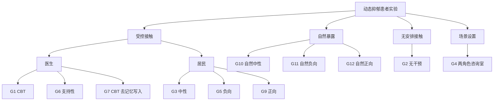
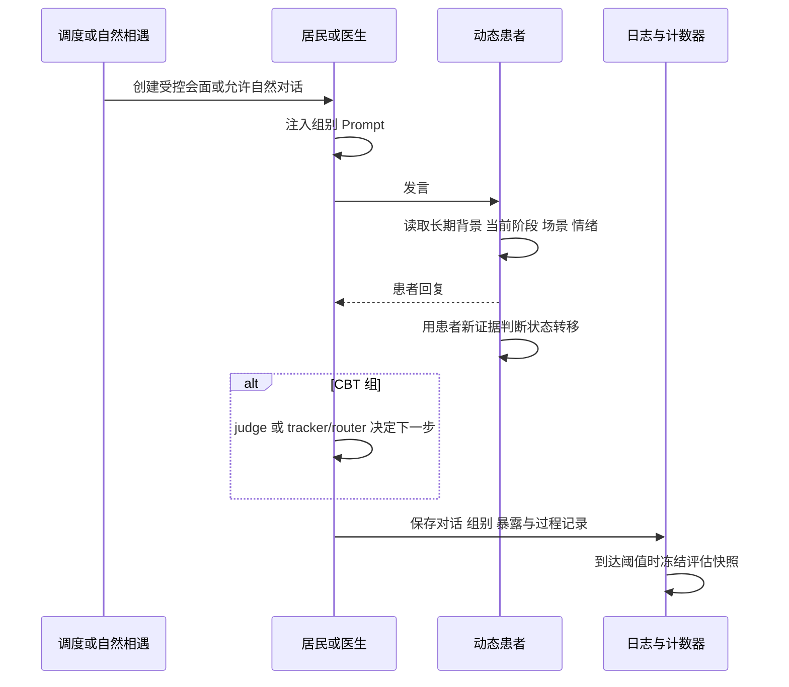
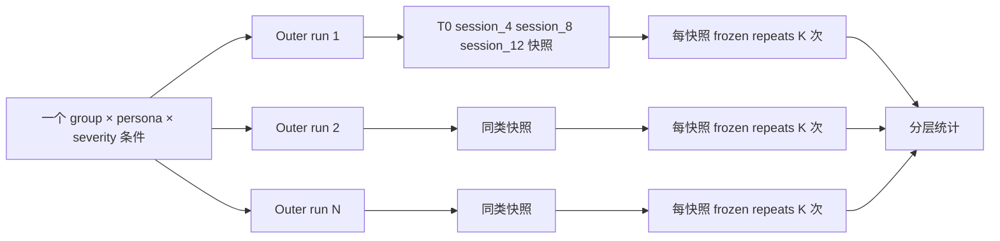

# 当前实验条件与重复实验结构

> 核对基线：2026-08-23。组别定义以 `experiments/config/groups/`、`experiments/config/personas/`、`experiments/config/severity/` 和当前批处理脚本的合并结果为准。

[返回总览](00_overview.md) · [动态人设](02_depression_persona.md) · [CBT 流程](03_cbt_pipeline.md) · [评估](04_evaluation.md)

## 1. 设计原则

实验条件主要改变三类变量：

1. **谁与患者接触**：医生、被调度居民、自然相遇居民或无人为接触；
2. **接触内容**：CBT、支持性、中性、负向或正向；
3. **患者可用机制**：是否允许目标患者写入通用记忆。

组别 overlay 采用深度合并：没有被组别文件覆盖的字段都继承当前 `data/config.json`。因此“组间保持一致”必须理解为**继承同一基础配置**，而不能只看组别名称。模型服务、地图、时间推进、动态人设基线等通常一致；会议调度、治疗 Prompt、判断器、记忆策略和评估触发则可能不同。

## 2. 主组别的实际实现

| 组别 | 操作变量 | 接触与 Prompt | CBT/推进 | 评估触发口径 | 重要差异 |
|---|---|---|---|---|---|
| G1 | 医生 CBT | 医生按规则定时会面；注入当前固定 session Prompt | 由入口决定：基础/直接批处理为 Legacy，端到端 shell 预设 Progressive | 每完成 4 次受控会面 | 开启 judge、session eval、咨询历史、医嘱提取、环境任务、动态人设 |
| G2 | 无干预 | 不安排医生或居民会面 | 无 | 每 24 step，映射为虚拟 4 次 exposure | 保留小镇自然运行、动态人设和基础记忆；无 CBT 日志 |
| G3 | 强制中性居民 | 每 6 step、phase 2，从三名居民中无重复随机选择；只约束居民一侧 Prompt | 无 | 每完成 4 次居民对话 | 关闭 CBT、咨询历史、医嘱、forced-chat memory policy；仍有通用本地记忆 |
| G5 | 强制负向居民 | 调度同 G3，Prompt 改为负向 | 无 | 每完成 4 次居民对话 | 与 G3 的核心差异是内容极性 |
| G6 | 支持性医生 | 医生每 6 step、phase 1 会面；医生侧支持性 Prompt | 不使用 CBT session，也不做 session 推进 | 每完成 4 次医生会面 | 保留咨询历史和动态人设；关闭 CBT judge/eval 与医嘱提取 |
| G7 | CBT 去记忆写入消融 | 会面与 G1 类似 | 是 | 每完成 4 次受控会面 | 对卡布达阻断 event/thought/chat 等主要通用记忆写入；不是“删除所有状态” |
| G9 | 强制正向居民 | 调度同 G3，Prompt 改为正向 | 无 | 每完成 4 次居民对话 | 与 G3/G5 的核心差异是内容极性 |
| G10 | 自然中性居民 | 不强制见面；自然对话发生时向非目标居民一侧注入中性 Prompt | 无 | 每 24 step | 暴露次数不固定，和 G3 不能只按标签直接等剂量比较 |
| G11 | 自然负向居民 | 同 G10，Prompt 改为负向 | 无 | 每 24 step | 当前较多新批次包含此组 |
| G12 | 自然正向居民 | 同 G10，Prompt 改为正向 | 无 | 每 24 step | 配置可运行，但当前新批次存档覆盖不足 |

### G4：咨询室设置

`--counsel-room` 合并 `data/config_counsel_room.json`，把环境换成 6×7 的两角色咨询室，只保留卡布达与蜻蜓队长，并用 `lite_non_consult` 减少非咨询期间的感知/反应开销。它通常仍使用用户选择的 CBT controller。

当前主组注册表没有 `G4` overlay；G4 是归档命名。论文应在以下两种定位中明确选择一种：

- **场景效率/隔离设置**：用于排除小镇噪声并加速咨询；或
- **正式实验条件**：把“完整小镇 vs 咨询室”作为环境消融。

在研究设计正式确认前，本文将其称为“G4 咨询室设置”，不默认视为与 G1–G12 完全同构的因果组。

## 3. 条件关系图



## 4. 各组改变什么、保持什么

### 4.1 通常保持一致

- 相同批次内使用同一基础模型与 embedding 配置；
- 同一患者条件使用同一 persona 和 mild/moderate/severe 初始严重度文件；
- 动态抑郁引擎、通用 Agent 生活循环和基本输出结构来自同一代码；
- 未被 overlay 覆盖的反思、checkpoint、事件记录和模型路由参数一致；
- 同一批处理命令下通常使用相同步数、时间跨度与 outer repeat 结构。

### 4.2 并未严格保持一致

- G3/G5/G9 关闭 forced-chat 的专用 memory policy；G10/G11/G12 继承基础设置。它们不仅在“强制 vs 自然”上不同，还可能在对话检索策略上不同。
- G7 阻断患者主要通用记忆写入，但动态人设状态机仍在运行，所以它不是“完全无记忆/无状态”。初始注入到底有多少内容被写入由写入拦截路径决定，解释结果时应核对日志。
- G2 和 G10–G12 没有受控会面计数，评估点用 step 间隔替代；它们的 `session_4` 只是对齐标签，不代表发生了 4 次对话。
- G4 改变地图、角色数量和非咨询行为负载，不能只归因于“治疗内容相同”。
- G6 虽然由医生接触，但没有 CBT session Prompt、judge、session eval 和医嘱提取，因此代表支持性接触而非简化 CBT。

## 5. 医生、支持性和居民对话的实现

### 5.1 G1/G7 医生 CBT

当前基础配置的会面规则实际为每 6 step、phase 1 触发，目标患者为卡布达，会面最长持续 2881 仿真分钟。规则名仍叫 `fast_every_4step`，名称与数值不一致，应以 `interval_steps=6` 为准。

医生发言前会读取当前固定 CBT session Prompt。Legacy 路径由 judge 给出本轮建议与是否结束会面，并在会后由 session evaluator 决定是否推进；Progressive 路径则使用 tracker/router、subgoal 批量控制和本地 adapter。医嘱提取和环境任务当前在 G1 基础路径启用，可能把治疗中的具体行动转化为后续生活事件与记忆。详见 [CBT 流程](03_cbt_pipeline.md)。

### 5.2 G6 支持性对话

G6 保留定时医生接触和咨询历史，用支持性 Prompt 引导医生倾听、共情和鼓励，但不注入 CBT session 大纲，不运行 CBT judge 或 session 推进，也不提取 CBT 医嘱。它用于区分“专业化结构化 CBT”与“同样由医生提供的支持性交流”。

### 5.3 G3/G5/G9 调度居民对话

居民调度器从田德莉娜、呱呱蛙、蟑螂恶霸中随机选择，并尽量避免连续重复。Prompt 只约束作为对话发起/居民侧的角色，患者仍由动态抑郁人设生成。三组的调度节奏一致，核心操作变量是居民表达的中性、负向或正向倾向。

### 5.4 G10/G11/G12 自然居民对话

这些组关闭人为会议队列。只有当小镇生活机制自然促成非目标居民与卡布达对话时，才对居民侧注入相应极性的 Prompt。它们更接近生态暴露，但实际对话次数、居民身份和发生时间都可能不同，分析时需要报告真实 exposure/dose。



## 6. Persona、严重度和运行组合

批处理把源 persona `KBD1` 至 `KBD9` 规范化为运行时角色名“卡布达”，并替换对应角色文件、抑郁配置和初始记忆注入资源。每个人设支持 mild、moderate、severe 三个严重度。

主组的配置空间为：

```text
9 个 persona × 10 个主组 × 3 个严重度 = 270 个可解析条件
```

这只是代码可生成的条件数。现有新批次主要集中于 KBD2 severe 和 G1/G2/G4/G5/G6/G9/G11；较早归档包含部分跨 persona、G3 和 G7。G10/G12 等配置尚未看到同等覆盖。实际 coverage 应从结果接口中的 condition coverage/manifest 计算。

咨询室模式在没有选择器时默认 KBD1 × 3 个严重度；显式选择器可扩展到 9 × 3。这个默认值与主组批处理不同。

## 7. Controller 维度

批处理还可选择三种 CBT controller：

| CLI 名称 | 运行时设置 | 会后推进机制 | 当前地位 |
|---|---|---|---|
| `legacy` | `cbt_controller_mode=legacy` | Legacy session evaluator | 基础配置和直接 Python 批处理默认 |
| `minimal` | `cbt_controller_mode=minimal`，Progressive D 关闭 | State Tracker + Router + Minimal evaluator | 当前可选实验 |
| `progressive` | minimal 模式外壳 + `progressive_d.enabled=true` | 原生批量 subgoal 控制 + 本地 stage adapter | 端到端 shell 当前预设 |

`run_batch_then_repeat_eval.sh` 当前设置 `CBT_CONTROLLER="progressive"` 并把它显式传给 Python 批处理；而基础配置与 `run_batch_experiment.py` 参数默认仍为 legacy。这是两个入口的真实差异，不应笼统写成单一“当前默认”。G10–G12 的 shell 工作流会强制回到 legacy，因为这些自然对话组本身不进入 CBT 控制。不同 controller 的同名组不能仅按组名汇总，必须把 controller identity 作为分层变量；非 CBT 组即使携带 controller identity，也要检查 overlay 后是否实际产生 CBT 过程记录。

## 8. 重复实验结构



- **Outer run**：从仿真初始化开始独立运行，包含生活、接触和状态变化。它才是组间推断的主要独立实验单位。
- **Frozen repeat**：在同一冻结状态上重复量表作答，主要估计测量随机性，不能当成新增患者或新增独立样本。
- 当前 shell 工作流默认 outer repeat 为 2、每快照量表重复 10 次；0802–0822 的部分归档使用 3 个 outer runs。最终数字必须以各批次 summary/manifest 为准。
- 当前没有形成严格的跨组同随机 seed 配对协议。除非 manifest 明确记录了配对键，否则统计上不应自行使用配对检验。

## 9. 实验运行产物

一次运行会形成两类目录：

- `results/checkpoints/<run>/`：运行中的对话、Agent 状态、事件、Prompt/判断轨迹、冻结快照和 resume 数据；
- `results/experiment_data/<run>/`：后处理后的对话、量表结果、汇总、压缩数据和可视化输入。

批处理还应保留组别、persona、severity、controller、配置摘要、父运行关系等 provenance。分析任何历史组前，应先检查这些字段，而不是从目录名反推方法。

## 10. 待确认事项

- G4 在论文中是否作为正式组别，还是只作为咨询室运行模式；
- G7 对所有初始注入与条件反思写入的实际拦截覆盖率，需要从对应运行日志做一次审计；
- 是否要把 G3/G5/G9 与 G10/G11/G12 的真实 exposure 做剂量匹配；
- 是否补跑 G10/G12 和完整 persona × severity coverage；
- 后续是否建立同 seed 跨组的配对实验设计。
