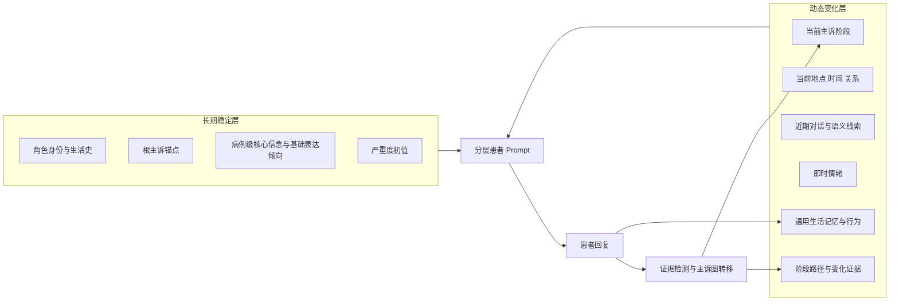
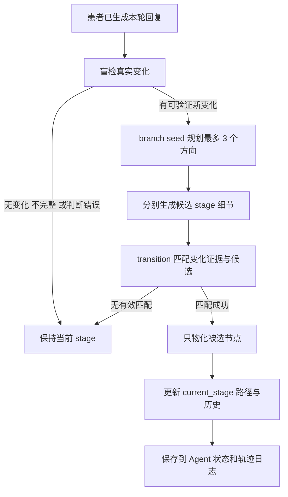
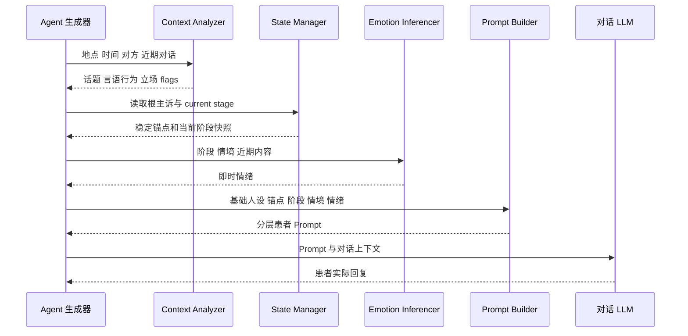
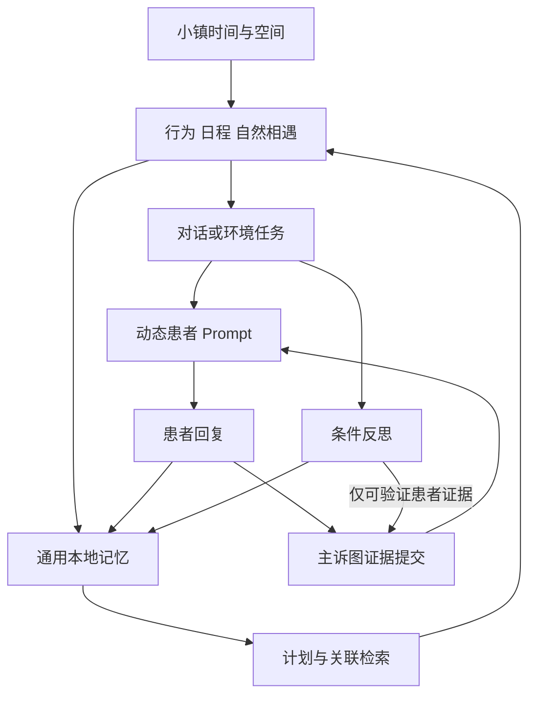

# 动态抑郁人设与主诉图机制

> 核对基线：2026-09-08（代码 `7aa4469`）。当前实现集中在 `modules/depression/`，运行时配置来自所选患者的 `depression_config_*.json` 与全局 `intervention.depression_dynamic`。

[返回总览](00_overview.md) · [实验条件](01_experimental_conditions.md) · [CBT 流程](03_cbt_pipeline.md) · [代码映射](06_code_mapping_and_maintenance.md)

## 1. 为什么需要动态抑郁人设

普通静态人设只能约束“这个人是谁”。本项目还要表达“此刻处于什么心理阶段、刚才的对话是否带来可信变化、这种变化能否延续到下一次生活或治疗”。因此患者生成被拆成：

- **长期稳定信息**：身份、生活史、压力背景、根主诉锚点、病例级核心信念和相对稳定的表达倾向；
- **动态变化信息**：当前主诉阶段、对话情境、即时情绪、变化证据、阶段历史以及通用生活记忆。

这样做的目的不是让 LLM 自由编写“病情进展”，而是把每次推进限制在可记录、可复核的患者证据上。

## 2. 长期稳定信息与动态变化信息

| 类型 | 内容 | 何时建立 | 是否允许变化 |
|---|---|---|---|
| 长期 | 基础角色 profile、生活背景、关系和当前处境 | 角色文件加载时 | 通常不在对话中改写 |
| 长期 | `root_complaint_anchor` 根主诉锚点 | depression config 初始化/恢复时 | 运行中固定；恢复时继续沿用 |
| 长期 | `core_belief` 病例级核心信念 | persona × severity 初始化/恢复时 | 运行中固定；所有 stage 只镜像同一个值 |
| 初始条件 | 严重度初值、初始阶段、叙事重点、表达风格、关系修饰 | persona × severity 配置加载时 | 作为后续动态阶段的起点；其中稳定运行态字段由子节点继承 |
| 动态 | `current_stage_id`、已物化阶段、路径、索引、访问历史 | 初始化后持续保存 | 可由证据驱动推进 |
| 动态 | 当前地点、时间、对话对象、关系、近期对话 | 每次回复前重建 | 每轮变化 |
| 动态 | 话题、言语行为、立场、风险/语义 flag | 每次回复前分析 | 每轮变化 |
| 动态 | 即时情绪向量/负荷 | 每次回复前由 LLM 或回退机制推断 | 每轮变化，并受波动上限约束 |
| 动态 | 通用本地记忆、日程、行为和反思 | 小镇生活循环产生 | 持续变化 |
| 默认未启用 | domain state 数值域状态 | 配置存在 | 全局默认关闭，不属于当前主流程 |
| 默认未启用 | depression 内部 trauma memory | 接口存在 | persona 配置默认关闭，当前通常为空 |

## 3. 初始化

运行器先选择患者 persona 与其支持的严重度。KBD1–KBD9 支持 mild/moderate/severe，并在运行时统一映射为“卡布达”；新增的 LRN/GC/CY/TW/ZYH/SQL/ZMY/XFH 分别保留林若宁、顾晨、陈屿、唐婉、周远航、苏晴岚、赵明远、许芳华的真实姓名，当前只支持 moderate。批处理会把真实目标姓名同步替换到干预、评估和后处理配置。

动态引擎初始化时读取：

1. 固定 `root_complaint_anchor`；
2. 病例级 `core_belief`：优先读 graph 顶层配置，否则取初始 stage；
3. `initial_stage_id` 与初始 stage 内容；
4. planner 参数，例如候选窗口上限 3、启用 LLM；
5. emotion 推断与波动限制；
6. 可选 domain state 与 trauma memory 配置；
7. Prompt 组装规则和运行时恢复状态。

当前 persona 配置通常只预置一个初始 stage。后续节点不是一开始生成完整树，而是在真正检测到变化时临时提出候选并只物化被选中的节点。

九个卡布达的静态 `agent.json` 已调整为只提供相对稳定的生活背景、兴趣、日常活动和关系倾向，不再预置“症状已经如何进展”“正在接受何种治疗”“近期已经尝试何种应对”等运行结果。八个实名人设各有独立稳定背景、moderate 动态配置和初始化压力记忆；它们的基础 `chat_iter` 当前统一为 4，也可叠加咨询室空间模板运行。动态症状表现、主诉变化和治疗反应仍由严重度配置、主诉图、生活事件与对话在运行时产生。各 persona × severity 可以有不同的病例级核心信念；“固定”仅指一次病例运行及其 checkpoint 恢复过程中不改写，并不表示所有严重度或人设共用同一句话。

## 4. Root complaint 与主诉图

### 4.1 根主诉锚点

根主诉锚点是患者长期痛苦的核心描述，承担两个作用：

- 保证跨 session、跨 checkpoint 的问题主线一致；
- 给治疗判断器提供长期策略上下文，避免只根据最近一句话判断。

它在恢复运行时保持不变，不应被普通对话摘要覆盖。

### 4.2 病例级核心信念

`core_belief` 是初始化时确定的病例级认知参照。管理器将它保存为只读属性，并把同一个值回填到配置节点、运行时候选节点、图快照和 checkpoint：

- 新运行优先使用 `complaint_graph.core_belief`；当前 persona 文件主要从 `initial_stage` 提供该值；
- planner 不再输出、改写或重新生成 `core_belief`；即使旧 Prompt 或脏数据仍返回该键，程序也会覆盖为病例固定值；
- 患者对该信念的强化、怀疑、松动、条件化表达或新理解，写入节点 `label/summary` 和证据，不创建另一条“新核心信念”；
- checkpoint 显式保存病例级值。恢复旧 checkpoint 时，优先级为 checkpoint 顶层值 → 旧保存配置/初始节点 → 旧运行时初始节点 → 当前 persona 配置，避免恢复时被新安装的资产或后代节点漂移值替换。

因此 `core_belief` 是长期病例锚点，不是治疗结局变量；研究认知变化应分析患者话语、节点摘要、证据和路径，而不是计算该字符串的前后差异。

### 4.3 当前阶段

当前阶段是根主诉在此时的具体表现，包含病例级核心信念的镜像、当前叙事重点、说话风格、情绪倾向和关系修饰。患者回复 Prompt 只展示**已确定的当前阶段**，不把未验证候选节点告诉患者。

### 4.4 候选节点和 planner

当前机制是 evidence-first 的延迟扩展：

1. 先盲检患者本轮是否出现真实的新变化；
2. 没有新变化就保持当前节点，不生成候选；
3. 有变化时，由 planner 先产生最多 3 个候选方向，再分别生成候选细节；候选只扩展 `label/summary/narrative_focus` 等动态语义，不生成核心信念；
4. transition LLM 把检测到的变化与这些候选匹配；
5. 只有匹配成功的候选被正式物化并写入路径，其余候选丢弃。

代码仍有 graph window 初始化等接口，但在当前 evidence-first 实现中是兼容 no-op。配置中的 `include_graph_window` 也不代表候选窗口会展示给患者；当前 Prompt builder 明确把 graph window section 留空。

### 4.5 防止无依据推进的约束

- transition 不看预先泄露给患者的候选，因为当前没有候选泄露；
- 变化证据主要来自患者自己的新话语和可验证行为；
- planner 派生节点时稳定运行态字段默认继承父节点；
- 核心信念始终回填病例级固定值；患者对它的动态关系只能由 `label/summary` 和证据表达；
- 已访问路径避免简单重复和循环；
- transition 的 LLM 调用失败、输出不完整或候选不合法时保持原 stage；没有启发式自动推进兜底。

## 5. 患者回复前读取什么

每次患者发言前，动态引擎先做 preview，不立即写状态：

1. **会话上下文**：地点、时间、对方、关系、对话类型和近期对话；强制医患咨询中使用较早内容摘要、最近 5 个完整 exchange（含未配对尾句）和按 transcript 字数估算的软时间提示；
2. **语义分析**：用规则识别话题、speech act、立场和重要 flag；
3. **当前主诉阶段**：读取 stage 内容、根主诉锚点和病例级固定核心信念；
4. **记忆接口**：读取 depression 内部 memory snapshot；当前默认关闭，通常不提供额外 trauma memory；
5. **即时情绪**：Emotion Inferencer 用 LLM 结合当前状态和情境推断，失败时使用回退结果；
6. **分层组装 Prompt**：基础 persona → 长期根主诉 → 当前阶段 → 当前情境 → 即时情绪。

## 6. 患者回复后判断和更新什么

实际回复完成后，Agent 才提交动态事件。提交内容包含患者本轮话语、最近的对方话语、会话元信息和可验证行为。State Manager 先运行 change detector；只有确认变化时才运行 planner 和 transition。

成功提交可能更新：

- 当前 stage 与已物化图；
- stage path、索引、访问历史和 interaction count；
- 动态对话/事件历史；
- 供 checkpoint 恢复的序列化状态；
- `depression_dynamic_llm_trace.jsonl` 中的各类 LLM 轨迹。

提交不会更新病例级 `core_belief`。新候选被清洗、正式提交和序列化时都会再次回填固定值，动态认知变化留在 stage 语义和证据轨迹中。

患者回复本身还会进入通用对话和记忆链；动态主诉图与通用本地记忆是两个相互影响但不等价的系统。Progressive D 的本地 Tracker 可以读取患者内部动态状态来形成结构化观察，但 Judge 和医生生成只接收长期病例背景与 Tracker 的观察状态，不直接暴露主诉图内部细节。

## 7. 与记忆、小镇行为和对话的关系

### 7.1 通用本地记忆

`modules/memory/` 与 Agent 的 associate/reflect 路径保存事件、想法、聊天和环境任务结果。它会影响日程、关联检索、后续计划和对话上下文，是日常生活连续性的主要来源。各 persona 还可在初始化时从自己的 `memory_injections*.json` 注入压力事件。当前外部 memory service 默认关闭，失败时回退本地。

### 7.2 动态抑郁内部 memory

`TraumaMemorySystem` 是动态抑郁模块的独立接口，但当前 persona 配置默认 `memory.enabled=false`，返回内容通常为空。它不能被描述成当前运行中已启用的创伤记忆机制。

### 7.3 反思

当前默认关闭旧 poignancy 累积分数触发，启用每 6 step 的全体周期反思，并在医生/居民聊天结束、环境任务结果等条件下反思。反思若提交到动态人设，只能以患者已说出的话或可观察行为作为证据，不能用抽象总结直接制造病情变化。

### 7.4 行为与对话

动态人设直接约束患者如何说；通用 Agent 系统决定何时移动、遇见谁、做什么和检索哪些生活记忆。环境任务可能把医生建议转化为患者后续行动，再形成事件记忆和反思证据，构成“治疗建议 → 生活行为 → 新证据”的闭环。

## 8. LLM 调用与非 LLM 规则的分工

| 环节 | LLM 作用 | 规则/本地约束 |
|---|---|---|
| 情境分析 | 当前主要用关键词/规则，不依赖自由生成 | 识别 topic、speech act、stance、flag |
| 即时情绪 | 推断当前情绪 | 失败回退、波动上限 |
| 患者回复 | 按分层人设生成自然语言 | Prompt 层次与可见字段固定 |
| 变化检测 | 判断是否出现新的患者变化证据 | 不完整/错误时保持 |
| 候选规划 | 有变化时生成最多 3 个方向和详情；用 `label/summary` 表达与固定核心信念的动态关系 | 只延迟生成、稳定字段继承、禁止 planner 改写 `core_belief` |
| 转移选择 | 将变化证据匹配候选 | 只允许合法候选、避免重复、失败保持 |

调用数量随本轮是否检测到变化而变：没有变化时不会运行候选详情与转移选择；有变化时可能产生多次 planner 调用。因此成本分析应使用轨迹日志实际计数。当前实验级 API 账本只对识别为 DeepSeek 的调用计费；默认由本地 Qwen 执行的动态人设调用仍需从动态 trace 统计调用量，不能把 DeepSeek 账本误当成全模型总成本。

## 9. 当前流程、可选功能与遗留代码

### 当前正式使用

- 稳定病例背景/根主诉/核心信念 + 当前 stage + 情境 + 即时情绪的分层 Prompt；
- evidence-first change detector → 临时候选 planner → transition；
- 病例级核心信念写入 graph snapshot/checkpoint，并在所有 stage 上强制保持一致；
- 其他动态状态写入 Agent checkpoint 与动态 LLM trace；
- 通用本地记忆、周期/条件反思与生活行为联动。

### 当前可选但默认关闭

- domain state 数值状态及其更新；
- 外部 memory service；
- depression 内部 trauma memory。

### 兼容/遗留

- `initialize_graph_window`/预生成窗口接口在当前实现是兼容 no-op；
- `context_analyzer` 的旧别名仍保留；
- 旧 depression update chain 已跳过，不能与当前 evidence-first 转移并列描述；
- 旧 checkpoint 的 domain reducer/transition 字段仍可能被读取，但不代表新运行会生成相同数据；
- 2026-08-25 前的 checkpoint 可能含有后代 stage 改写过的 `core_belief`；新代码可恢复这些 checkpoint，但会按旧初始节点等兼容优先级选定一个病例值，并统一回填所有节点。恢复兼容不代表核心信念轨迹仍具同一方法语义。

## 10. 待确认与方法限制

- persona 文本和严重度初值的构造/标注依据需要单独形成数据来源说明；代码只能确认其使用方式，不能确认其临床效度。
- 八个实名人设目前只有 moderate 资产；它们不能参与 mild/moderate/severe 完整交互，也不能因使用相同运行接口就与 KBD 变体视为同一来源的人设集合。
- 病例级核心信念由 persona × severity 资产预设并在运行中固定，其构造依据、临床合理性和跨严重度可比性仍需人工/专家审查；固定机制只防止运行时漂移，不提供内容效度。
- 患者对固定核心信念的态度变化被压缩到 `label/summary`，可能损失强度和置信度信息；若要把认知重构作为主要结局，应新增独立、可审计的动态字段或人工编码。
- 量表逐题回答会复用动态患者的 preview/生成层，但当前 `answer_without_memory` 不执行动态 commit；每题读取同一冻结状态且不继承上一题对话。后续若改动该接口，应做无状态写入回归测试。
- G7 只阻断通用记忆写入，不关闭动态 stage；论文中建议称“memory-write ablation”，不要简称“memory-free patient”。
