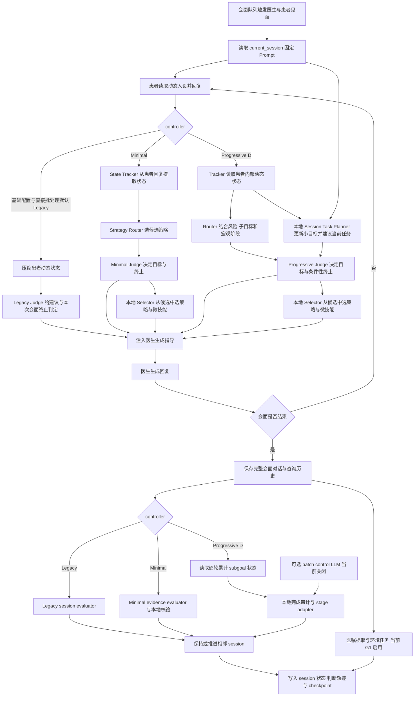
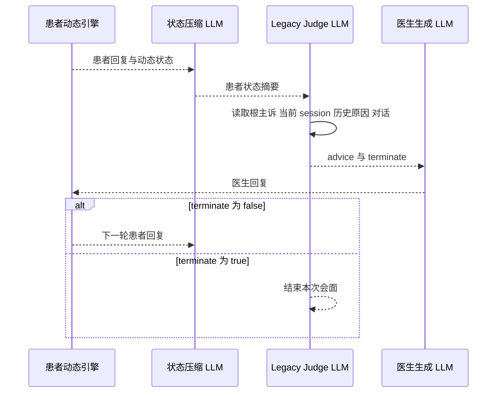
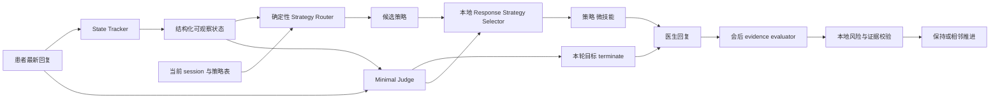
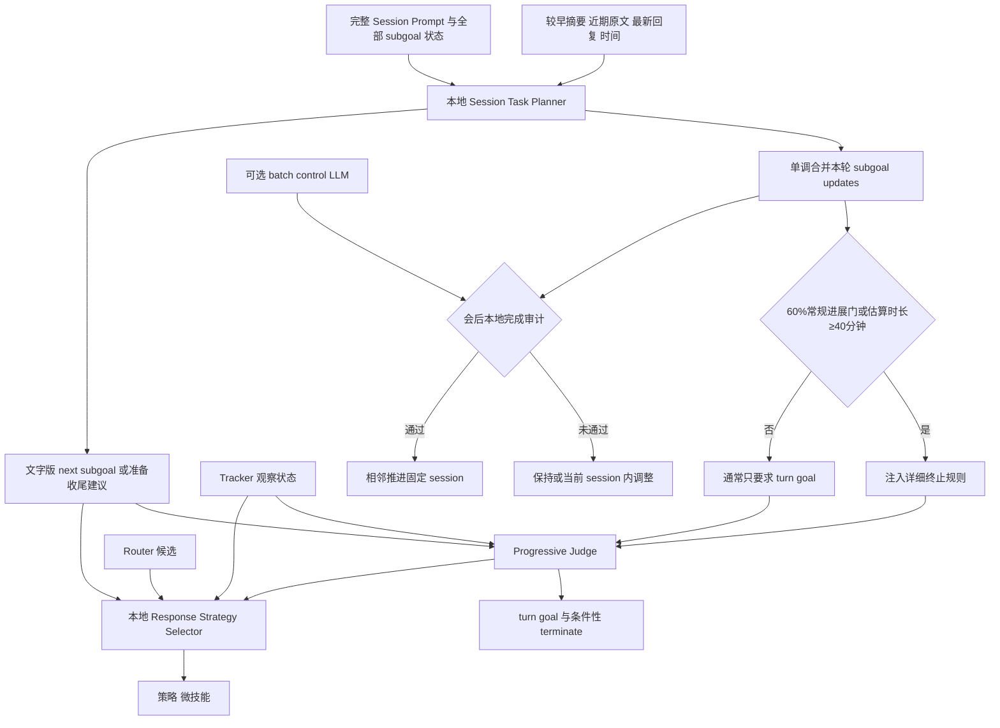

# CBT 治疗控制流程

> 核对基线：2026-09-08（代码 `7aa4469`）。基础配置和直接 Python 批处理默认 **Legacy**；端到端 shell 工作流当前预设 **Progressive D**。以下分别描述三条真实路径，具体运行以 manifest 为准。

[返回总览](00_overview.md) · [实验条件](01_experimental_conditions.md) · [动态人设](02_depression_persona.md) · [评估](04_evaluation.md)

## 1. CBT 模块要解决什么问题

固定 session Prompt 只告诉医生“这一阶段要做什么”，仍不足以回答：患者此刻状态如何、医生下一句采用什么策略、何时结束本次会面、何时推进治疗大纲。CBT 控制层因此分成四种职责：

1. **Session Prompt Manager**：维护固定治疗大纲及当前节点；
2. **轮内观察与决策**：Legacy Judge，或 Minimal/Progressive 的 State Tracker + Strategy Router + Judge + 本地 Response Strategy Selector；
3. **医生生成**：把治疗目标、患者状态和下一步策略注入医生回复；
4. **会后推进**：Legacy/Minimal session evaluator，或 Progressive D 对逐轮小目标状态的本地完成审计（会后 batch control LLM 当前默认关闭）。

必须区分三种“阶段”：

- `current_session`：固定 CBT 大纲节点，如 `session2.1`；
- Progressive D 的 macro stage/subgoal：一个 session 内的过程控制；
- 动态患者的 `current_stage_id`：主诉图中的心理状态。

它们相互提供上下文，但任何一个都不能直接替代另一个。

## 2. 当前固定 CBT 大纲

当前正式顺序是：

```text
session1
→ session2.1 → session2.2 → session2.3
→ session3.1 → session3.2 → session3.3-A → session3.3-B
→ session4.1 → session4.2 → session4.3 → session4.4
```

这 12 场依次覆盖：关系/共同评估、活动—情绪地图、自动思维与温和重构、共享概念化、认知—行为并行干预、低门槛行为实验、实验复盘、现实问题解决、深层信念现实检验、技能整合、复发预防，以及巩固与结束。`session3.3-B` 和 `session4.3` 已从备用 Prompt 进入正式顺序；`session_loop` 仍不在当前 `session_order`。

每次强制医生会面时，只对医生侧注入当前 session Prompt。患者侧仍由动态抑郁人设控制。会面结束不必然表示 session 完成；同一 session 可以跨多次会面继续。

## 3. 总体 CBT 流程



## 4. Legacy 流程

Legacy 仍是受支持的正式基线，不是“废弃代码”。当前 `data/config.json` 和直接调用 `run_batch_experiment.py` 的参数默认选择它；但 `run_batch_then_repeat_eval.sh` 当前预设 `progressive` 并显式覆盖，所以由该 wrapper 产生的运行不能按 Legacy 解释。

### 4.1 每轮医生回复前

1. 患者使用动态人设生成回复并提交状态变化；
2. 系统用 `dialog_judge_patient_state_summary.txt` 压缩患者当前动态状态，避免把全部内部状态直接堆给 judge；
3. Legacy judge 读取根主诉策略上下文、当前 session Prompt、同一 session 上一次评估原因、最新患者回复、有界会谈上下文和患者状态摘要；有界上下文由较早摘要与最近 5 个 exchange 组成，并附按 transcript 字数估算的已进行分钟数；
4. judge 输出医生下一轮应如何回应的 advice，以及是否应该结束**当前会面**；
5. advice 被注入医生 Prompt，医生通过 forced LLM 路由生成回复。

`terminate=true` 只结束当前 meeting，不等于当前固定 CBT session 已完成。

三条 controller 当前共享“完成治疗闭环后再收束”的原则：不能因轮数或单个小目标机械结束，常规情况下应完成够用探索、至少一次实质干预、获取患者反馈，并形成总结与下一步安排。强制会谈全局安全上限为 60 轮，`forced_chat_min_turns=2` 是更低层的最小结束保护而不是推荐疗程长度。配置中的 54 轮 tail window 控制无 dialog judge 时的通用 `decide_chat_terminate` 检查窗口，不应解释成 CBT Judge 从第 7 轮才开始工作；Legacy/Minimal Judge 仍按各自契约逐轮运行，Progressive D 则使用下文的进展/时长动态终止契约。



### 4.2 会后 session 推进

Legacy session evaluator 读取当前 session Prompt、同一 session 历史、使用记录和本次完整对话，输出：

- `efficacy_score`：本轮治疗效果评估；
- `session_end`：是否完成当前固定 session；
- `reason`：证据与原因。

只有 `session_end=true` 才推进到顺序表中相邻的下一个 session，否则保持原 session。当前 consult record 独立记录关闭，但 consult history 开启，可为后续会面提供压缩历史。

### 4.3 会后生活闭环

当前基础配置启用医嘱提取：从医生会面中抽取可执行建议，环境模型生成任务/结果，并把结果写成事件记忆。它让治疗不只存在于谈话文本中，而能影响后续小镇行为、记忆和反思。G6 等 overlay 会关闭这条路径。

## 5. Minimal 流程

Minimal 的目标是把“患者状态观察”和“治疗策略选择”拆开，使判断结果更结构化。

### 5.1 State Tracker

每个被接受的患者回复后，think LLM 从最近回复和近期对话中提取：

- emotion load；
- engagement；
- resistance；
- clarity；
- risk；
- evidence。

它是医生可观察状态，不等同于动态患者主诉图内部状态。

### 5.2 Strategy Router

Router 是确定性规则层。它读取当前 session、tracker 状态、策略映射和术语表，根据风险、支持需要、阻抗等条件筛出允许的候选策略。这样后置 Selector 只能在受控集合中选择。

### 5.3 Minimal Judge 与会后评估

Minimal judge 读取当前 Prompt、最新患者回复、近期对话、此前进展和 tracker 状态，只决定：

- 本轮目标；
- 是否结束会面。

随后本地 vLLM Response Strategy Selector 读取 Judge 的 `turn_goal`、患者最新回复、tracker 观察状态、近期对话和 Router 候选，只从候选中选择 primary strategy 与 micro skill。它不重新决定治疗任务，路由固定为医生侧本地 `think_llm`，不会新增 DeepSeek Judge 调用；无效或越界输出回退到 Router 候选中的安全优先组合，并单独写入 forced prompt trace。

会后 Minimal evaluator 输出 session progress、证据所在患者轮次、阻碍和原因。本地校验再检查风险和证据是否足够，最终生成 `session_end`，只允许相邻推进。



## 6. 原生 Progressive D 流程

CLI 的 `progressive` 会把运行时设为 minimal 控制外壳，同时开启 `progressive_d`。当前版本标识为 `progressive_d_v3_1_calibrated_batch_control`。它不再依赖旧的 A/B/C/D transition flag，而是把固定 Prompt 拆成可累计完成的 subgoal。

### 6.1 轮内控制

- Tracker 可以读取患者**内部动态状态**并抽取安全/风险信号；原始内部状态只供 Patient Agent 与本地 Tracker 使用，不直接传给 Judge 或医生；
- Router 同时参考固定 session、宏观阶段、subgoal 状态和策略映射；
- 本地 vLLM Session Task Planner 读取完整 Session Prompt、全部 subgoal 与保存状态、最新患者回复、较早摘要 + 近期原文和软时间信号，只输出增量 `subgoal_updates` 与 `next_subgoal_id`；更新经严格校验后单调合并到既有进度状态。
- Progressive Judge 读取 Planner 的文字版建议、有界会面上下文、长期病例背景、Tracker 观察状态，以及估算时长/目标时长/当前轮数/最大轮数信号。Judge 不机械执行 `next_subgoal_id`；Planner 的“准备收尾”只是非强制节奏建议，`terminate=true` 的唯一代码门禁是 `termination_check_enabled=true`，门禁开启后仍由 Judge 判断临床闭环和最终会面终止。
- 后置的本地 vLLM Response Strategy Selector 读取患者最新回复、Tracker 观察状态、有界对话、Planner `next_subgoal_id`、Judge `turn_goal` 和 Router 候选，仅从候选中给出策略与微技能。

### 6.2 按进展或时长动态启用终止规则

Progressive D 每轮先用逐轮累计的 subgoal 状态运行本地完成审计。只有满足以下任一条件，才把独立的详细终止规则片段注入 Judge：

- 小目标加权完成度达到 `intervention.progressive_d.completion_threshold_ratio` 配置的常规 60% 门槛，且至少一个 subgoal 为 `complete`；这里不采用“同一 Prompt 已进行 3 次 meeting 后 40%”的会后推进兜底；
- 按对话字符估算的会谈时长达到 `earliest_closing_check_minutes`，当前默认 40 分钟。

详细规则启用后，Judge 必须同时返回 `turn_goal` 与布尔 `terminate`；`terminate=true` 仍需确认重点明确、发生实质治疗、患者有真实反馈或行动、新材料已处理，且医生下一句可以完成总结与后续安排，但不要求 Planner 同轮输出“准备收尾”。启用前 Judge 只返回 `turn_goal`，缺失或误输出的 `terminate` 都会规范化为 `false`。

默认 Prompt 同时显示估算已进行分钟数、60 分钟推荐目标时长、当前轮数和 60 轮最大值。这些是节奏信号：接近目标时应减少重复探索并推进干预、反馈和总结，但时间或轮数本身不证明治疗完成。60 轮同时也是聊天循环的硬上限，因此即使临床闭环仍未成立，会面也会在上限处结束。

forced prompt trace 的 `judge_llm` 记录会保存 `termination_check_enabled` 与 `subgoal_progress_threshold_reached`，用于区分“未开放常规终止”“按进展开放”和“按估算时长开放”。

### 6.3 会后完成审计（batch control 可选）

会后不运行 Minimal session evaluator。当 `progressive_d.control_eval.enabled=false`（当前默认）时，本地 adapter 直接读取 Session Task Planner 逐轮累计的 `none/partial/complete` 状态并做完成审计；开关重新启用时，则保留原 forced LLM 对当前固定 session 全部 subgoal 的会后批量评估。无论状态来源为何，LLM 都不能单独宣布 session 完成。

本地 adapter 再执行：

1. 校验 controller/version、meeting/session freshness；
2. 合并历史累计 subgoal 进度；
3. 检查风险、安全与累计完成度：通常要求加权得分达到配置的 60% 且至少 1 个 subgoal 完成；同一 Prompt 已进行至少 3 次 meeting 时，可用 40% 且至少 1 个完成的兜底；出现高风险则阻断完成；
4. 处理 stay、side step、soft step-back、hold 等动作；
5. 仅当本地完成审计通过时设置 `session_end`，并按固定顺序相邻推进。

side step 与 soft step-back 是当前 session 内的临时调整，不允许自由跳到任意 session。配置列出的 allowed actions 与 adapter 内部支持动作并非完全同名，解释日志时应优先看 `effective_action` 和最终 `session_end`，这是一个需要继续统一的技术债。



## 7. 各 LLM 调用的作用、输入和输出

下表只列 CBT 及其直接相关调用；患者动态人设的 emotion/change/planner/transition 调用见[动态人设](02_depression_persona.md)。

| 调用 | 何时用 | 主要输入 | 主要输出 |
|---|---|---|---|
| 患者状态压缩 | Legacy 每个医生决策前 | 动态患者状态、病例级固定核心信念、当前对话 | 面向 judge 的简短状态摘要；核心信念不是随治疗更新的结局字段 |
| Legacy dialog judge | Legacy 每个医生回复前 | 根主诉、session Prompt、历史评估原因、对话、状态摘要 | advice、meeting terminate |
| State Tracker | Minimal/Progressive 每个患者回复后 | 最新回复/近期对话，Progressive 可读内部状态 | 情绪、投入、阻抗、清晰度、风险、证据 |
| Minimal judge | Minimal 每个医生回复前 | tracker、session、对话、此前进展 | 目标、terminate |
| Session Task Planner | Progressive 每个医生回复前，本地 vLLM | 完整 Session Prompt、全部 subgoal 状态、最新患者回复、较早摘要 + 近期原文、已进行分钟数 | 本轮 `subgoal_updates`、`next_subgoal_id` 或“准备收尾” |
| Progressive judge | Progressive 每个医生回复前 | Planner 文字建议、有界会面上下文、长期病例背景、Tracker 观察状态、估算/目标时长与当前/最大轮数；达到进展或 40 分钟门后再加详细终止规则 | 始终有目标；规则启用后必须有 terminate，启用前通常省略并按 false 处理，紧急意外结束可提前为 true |
| Response Strategy Selector | Minimal/Progressive 每个 Judge 之后，本地 vLLM | 最新患者回复、Tracker 观察状态、有界对话、Planner `next_subgoal_id`（若有）、Judge `turn_goal`、Router 候选 | 候选内的策略、微技能 |
| 医生生成 | 每个医生轮次 | 医生人设、session Prompt、judge guidance、对话 | 医生自然语言回复 |
| Legacy session evaluator | Legacy 会后 | session Prompt、同 session 历史、使用日志、完整对话 | efficacy、session_end、reason |
| Minimal evidence evaluator | Minimal 会后 | 当前 session、会面对话、tracker/进展 | progress、证据轮次、block、reason |
| Progressive batch control（可选，默认关闭） | Progressive 会后 | 全部 subgoal、完整会面、患者状态、累计进度 | 每目标状态、证据、建议动作 |
| 咨询历史摘要 | 开启且需要压缩时 | 既往会面 | 后续会面可用的简要历史 |
| 医嘱抽取 | 当前 G1/G7 会后 | 医生/患者会面对话 | 可执行生活建议 |
| 环境任务模型 | 抽取到医嘱后 | 医嘱、小镇情境、患者状态 | 任务结果与可写入记忆的事件 |

Strategy Router、Selector 候选校验/安全回退、Progressive 终止规则启用门、本地 session 顺序校验、Progressive adapter、安全门和计数器不是自由 LLM 决策，而是本地规则。

默认 DeepSeek 路由开启 high reasoning；终止检测、consult record、环境任务、强制路由的咨询历史摘要兼容路径和当前会谈摘要等低复杂度 caller 可按配置关闭 thinking。调用事件会把实际 request options、缓存命中/未命中、reasoning 与可见输出 token 写入实验级成本账本，因此不同 controller 的成本比较必须同时报告调用模块和推理选项。

## 8. 会谈上下文、会后摘要与跨会谈历史

当前医生咨询有三种不同寿命的文本，不应混用：

- **当前会谈滚动上下文**：较早对话压缩到最多 600 字，最近 5 个完整 exchange 保留原文；缓存只存在于管理器运行时，会谈结束清除，不写入长期记忆或 checkpoint。摘要默认走 `think_llm`。
- **会后咨询记忆摘要**：仅 `meeting_kind=doctor_consult` 的强制医患咨询使用高密度模板，最多 1000 字；强制居民聊天不会套用治疗摘要。完整原始 transcript 仍保存在运行记录中。
- **跨会谈 consult history**：先由 gate 判断是否检索，Top-K 默认 3；命中项优先使用已保存 `chat_summary`，只有缺失摘要的记录才读取最多 1200 字 transcript 片段，最终聚合摘要最多 800 字。默认 summary route 已改为本地 `think_llm`，显式 `forced_llm` 只作兼容选择。

按字数估算的“已进行分钟数”（默认 180 字/分钟）不推进同步聊天循环中的仿真时钟，也不包含模型延迟或停顿。它一般只是节奏提示，但在 Progressive D 中还会与小目标进展共同决定何时注入详细终止规则；当前最早时长门为 40 分钟，推荐目标为 60 分钟。因此它仍不能解释为真实治疗分钟数，却已经是控制路径的一部分。

对三种 controller 都应遵守同一解释边界：治疗可以改变患者对固定核心信念的相信程度、条件化表达和应对方式，但这些变化记录在患者话语、证据与主诉节点语义中，不能用 `core_belief` 字符串是否改变来判定 CBT 是否奏效。

## 9. Session 完成后的行为

基础配置包含 post-treatment follow-up 相关开关，同时又在完成治疗后停止对应 meeting rule 调度。按当前默认批处理，不能据此假定系统一定会自动生成长期随访；真正的 follow-up 需要 shell 工作流显式创建带 parent lineage 的后续无干预阶段，而且该功能默认关闭。

“session 完成记忆注入”规则当前关闭。不要把固定 session 完成自动写入患者记忆描述成现行机制。环境任务结果与聊天后的条件反思仍可形成记忆。

## 10. 当前正式、可选与遗留机制

### 基础配置与直接 Python 入口默认

- 固定 12 节点 session 顺序；
- Legacy judge 的轮内指导；
- Legacy session evaluator 的会后相邻推进；
- 咨询历史；
- G1 的医嘱抽取与环境任务闭环。

### 当前其他正式实现

- Minimal 的 State Tracker、Strategy Router、结构化 judge 和 evidence evaluator；
- 原生 Progressive D 的本地 Session Task Planner、默认本地完成审计、可选 subgoal 批量控制与本地 stage adapter；它是端到端 shell 当前预设；
- Minimal/Progressive 共用的本地 Response Strategy Selector，以及 Progressive D 按进展/估算时长动态启用的详细终止规则；
- 医患咨询的有界滚动上下文、软时间提示、会后高密度摘要与本地 consult-history 摘要；
- 咨询室精简运行。

### 未进入当前顺序/默认关闭

- `session_loop` Prompt；
- consult record；
- session-completed memory injection；
- 自动 T4/长期 follow-up。

### 兼容/遗留

- 旧 `legacy_stage_transition_adapter` 配置和 A–D stage flag 只为旧 checkpoint 兼容；原生 Progressive D 不使用旧判定链；
- 一些 adapter 命名仍含 legacy/stage 字样，但当前作用是把新控制结果投影到固定 session manager；不能仅凭文件名判断流程；
- 旧 depression update chain 不再负责 CBT 推进；
- `legacy_poignancy` 反思触发默认关闭。

## 11. 方法限制与待确认

- Legacy 依赖 LLM 同时给 advice 和 terminate，结构化证据门弱于 Progressive；作为主分析时需报告这一限制。
- Minimal/Progressive 与 Legacy 使用不同判断链；它们是 controller 比较，不应无分层合并。
- Progressive 的宏观 stage、subgoal、固定 session 和动态患者 stage 命名需要在输出 schema 中进一步统一。
- 会谈时长由文本字符估算，不能作为真实治疗分钟数或 latency 指标；但它在 Progressive D 中会触发详细终止规则，字符生成风格差异可能因此改变控制时点，需要在跨模型/跨 persona 比较中审计。
- 进展门与会后 session 推进共用配置的常规 60% 完成阈值，但只有会后推进允许 meeting-cap 的 40% 兜底；“允许 Judge 检查结束”和“允许推进固定 session”仍不是同一个判定。
- 当前咨询 Prompt 是否都经过临床专家逐条审核，代码无法确认。
- follow-up 与完成后停止调度的组合需要端到端测试，确认预期的治疗后对话是否真的发生。
- controller 默认值在基础配置、Python 入口和 shell wrapper 间不一致，应统一或在运行名中强制编码 controller。
