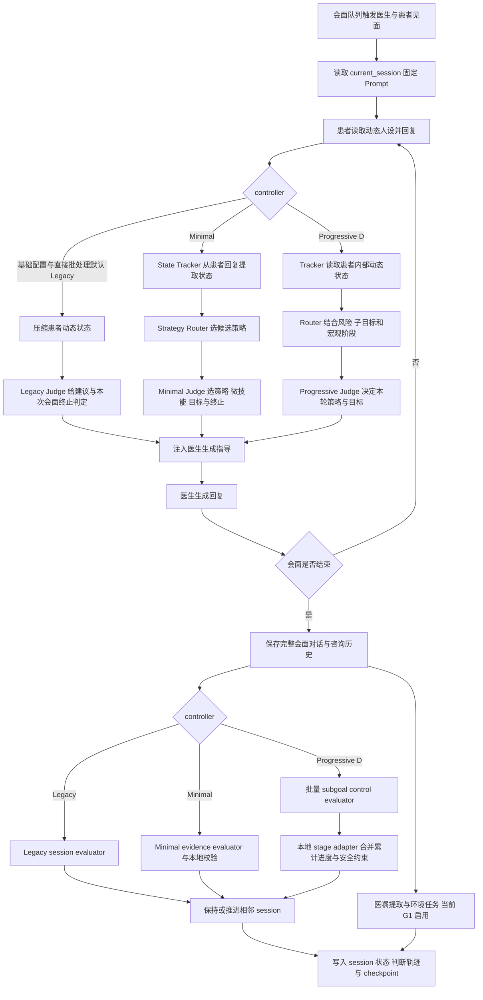
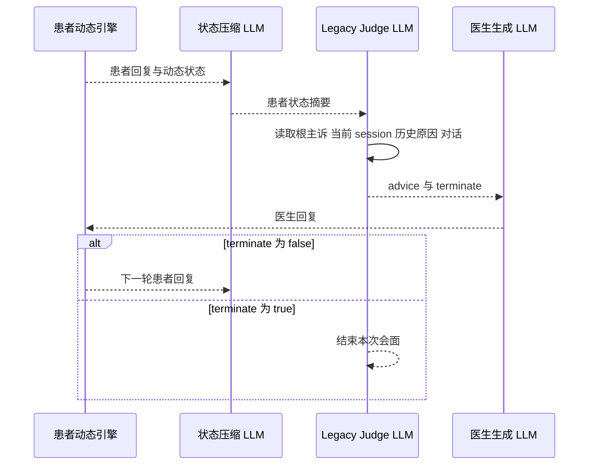
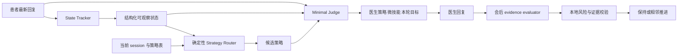
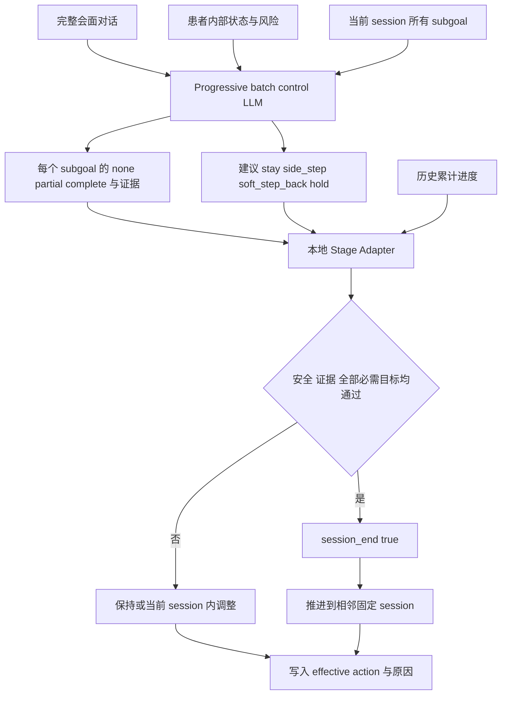

# CBT 治疗控制流程

> 核对基线：2026-08-23。基础配置和直接 Python 批处理默认 **Legacy**；端到端 shell 工作流当前预设 **Progressive D**。以下分别描述三条真实路径，具体运行以 manifest 为准。

[返回总览](00_overview.md) · [实验条件](01_experimental_conditions.md) · [动态人设](02_depression_persona.md) · [评估](04_evaluation.md)

## 1. CBT 模块要解决什么问题

固定 session Prompt 只告诉医生“这一阶段要做什么”，仍不足以回答：患者此刻状态如何、医生下一句采用什么策略、何时结束本次会面、何时推进治疗大纲。CBT 控制层因此分成四种职责：

1. **Session Prompt Manager**：维护固定治疗大纲及当前节点；
2. **轮内观察与决策**：Legacy Judge，或 Minimal/Progressive 的 State Tracker + Strategy Router + Judge；
3. **医生生成**：把治疗目标、患者状态和下一步策略注入医生回复；
4. **会后推进**：Legacy/Minimal session evaluator 或 Progressive D 的 subgoal 批量控制与本地 adapter。

必须区分三种“阶段”：

- `current_session`：固定 CBT 大纲节点，如 `session2.1`；
- Progressive D 的 macro stage/subgoal：一个 session 内的过程控制；
- 动态患者的 `current_stage_id`：主诉图中的心理状态。

它们相互提供上下文，但任何一个都不能直接替代另一个。

## 2. 当前固定 CBT 大纲

当前正式顺序是：

```text
session1
→ session2.1 → session2.2 → session2.3
→ session3.1 → session3.2 → session3.3-A
→ session4.1 → session4.2 → session4.4
```

Prompt 资产目录还包含 `session3.3-B`、`session4.3` 和 `session_loop`，但它们不在当前 `session_order` 中，不应出现在当前正式治疗流程图中。

每次强制医生会面时，只对医生侧注入当前 session Prompt。患者侧仍由动态抑郁人设控制。会面结束不必然表示 session 完成；同一 session 可以跨多次会面继续。

## 3. 总体 CBT 流程



## 4. Legacy 流程

Legacy 仍是受支持的正式基线，不是“废弃代码”。当前 `data/config.json` 和直接调用 `run_batch_experiment.py` 的参数默认选择它；但 `run_batch_then_repeat_eval.sh` 当前预设 `progressive` 并显式覆盖，所以由该 wrapper 产生的运行不能按 Legacy 解释。

### 4.1 每轮医生回复前

1. 患者使用动态人设生成回复并提交状态变化；
2. 系统用 `dialog_judge_patient_state_summary.txt` 压缩患者当前动态状态，避免把全部内部状态直接堆给 judge；
3. Legacy judge 读取根主诉策略上下文、当前 session Prompt、同一 session 上一次评估原因、近期/完整对话和患者状态摘要；
4. judge 输出医生下一轮应如何回应的 advice，以及是否应该结束**当前会面**；
5. advice 被注入医生 Prompt，医生通过 forced LLM 路由生成回复。

`terminate=true` 只结束当前 meeting，不等于当前固定 CBT session 已完成。



### 4.2 会后 session 推进

Legacy session evaluator 读取当前 session Prompt、同一 session 历史、使用记录和本次完整对话，输出：

- `efficacy_score`：本轮治疗效果评估；
- `session_end`：是否完成当前固定 session；
- `reason`：证据与原因。

只有 `session_end=true` 才推进到顺序表中相邻的下一个 session，否则保持原 session。当前 consult record 独立记录关闭，但 consult history 开启，可为后续会面提供压缩历史。

### 4.3 会后生活闭环

当前基础配置启用医嘱提取：从医生会面中抽取可执行建议，环境模型生成任务/结果，并把结果写成事件记忆。它让治疗不只存在于谈话文本中，而能影响后续小镇行为、记忆和反思。G6 等 overlay 会关闭这条路径。

## 5. Minimal 流程

Minimal 的目标是把“患者状态观察”和“治疗策略选择”拆开，使判断结果更结构化。

### 5.1 State Tracker

每个被接受的患者回复后，think LLM 从最近回复和近期对话中提取：

- emotion load；
- engagement；
- resistance；
- clarity；
- risk；
- evidence。

它是医生可观察状态，不等同于动态患者主诉图内部状态。

### 5.2 Strategy Router

Router 是确定性规则层。它读取当前 session、tracker 状态、策略映射和术语表，根据风险、支持需要、阻抗等条件筛出允许的候选策略。这样 judge 不是在所有治疗方式中自由搜索。

### 5.3 Minimal Judge 与会后评估

Minimal judge 读取当前 Prompt、最新患者回复、近期对话、此前进展、tracker 状态和候选策略，选择：

- primary strategy；
- micro skill；
- 本轮目标；
- 是否结束会面。

会后 Minimal evaluator 输出 session progress、证据所在患者轮次、阻碍和原因。本地校验再检查风险和证据是否足够，最终生成 `session_end`，只允许相邻推进。



## 6. 原生 Progressive D 流程

CLI 的 `progressive` 会把运行时设为 minimal 控制外壳，同时开启 `progressive_d`。当前版本标识为 `progressive_d_v3_1_calibrated_batch_control`。它不再依赖旧的 A/B/C/D transition flag，而是把固定 Prompt 拆成可累计完成的 subgoal。

### 6.1 轮内控制

- Tracker 读取患者**内部动态状态**，而不是只读表面对话，并抽取安全/风险信号；
- Router 同时参考固定 session、宏观阶段、subgoal 状态和策略映射；
- Progressive judge 读取完整会面、患者内部/可观察状态、subgoal 快照和候选策略，给出本轮策略、微技能、目标与 meeting terminate。

### 6.2 会后批量控制

会后不运行 Minimal session evaluator，而由 forced LLM 对当前固定 session 的所有 subgoal 一次性标记 `none/partial/complete`，并给出证据和建议动作。LLM 只提供观察结果和建议，不能单独宣布 session 完成。

本地 adapter 再执行：

1. 校验 controller/version、meeting/session freshness；
2. 合并历史累计 subgoal 进度；
3. 检查风险、安全、证据质量和所有必需 subgoal；
4. 处理 stay、side step、soft step-back、hold 等动作；
5. 仅当本地完成审计通过时设置 `session_end`，并按固定顺序相邻推进。

side step 与 soft step-back 是当前 session 内的临时调整，不允许自由跳到任意 session。配置列出的 allowed actions 与 adapter 内部支持动作并非完全同名，解释日志时应优先看 `effective_action` 和最终 `session_end`，这是一个需要继续统一的技术债。



## 7. 各 LLM 调用的作用、输入和输出

下表只列 CBT 及其直接相关调用；患者动态人设的 emotion/change/planner/transition 调用见[动态人设](02_depression_persona.md)。

| 调用 | 何时用 | 主要输入 | 主要输出 |
|---|---|---|---|
| 患者状态压缩 | Legacy 每个医生决策前 | 动态患者状态、当前对话 | 面向 judge 的简短状态摘要 |
| Legacy dialog judge | Legacy 每个医生回复前 | 根主诉、session Prompt、历史评估原因、对话、状态摘要 | advice、meeting terminate |
| State Tracker | Minimal/Progressive 每个患者回复后 | 最新回复/近期对话，Progressive 可读内部状态 | 情绪、投入、阻抗、清晰度、风险、证据 |
| Minimal judge | Minimal 每个医生回复前 | tracker、候选策略、session、对话、此前进展 | 策略、微技能、目标、terminate |
| Progressive judge | Progressive 每个医生回复前 | 完整会面、内部与观察状态、subgoal、候选策略 | 策略、微技能、目标、terminate |
| 医生生成 | 每个医生轮次 | 医生人设、session Prompt、judge guidance、对话 | 医生自然语言回复 |
| Legacy session evaluator | Legacy 会后 | session Prompt、同 session 历史、使用日志、完整对话 | efficacy、session_end、reason |
| Minimal evidence evaluator | Minimal 会后 | 当前 session、会面对话、tracker/进展 | progress、证据轮次、block、reason |
| Progressive batch control | Progressive 会后 | 全部 subgoal、完整会面、患者状态、累计进度 | 每目标状态、证据、建议动作 |
| 咨询历史摘要 | 开启且需要压缩时 | 既往会面 | 后续会面可用的简要历史 |
| 医嘱抽取 | 当前 G1/G7 会后 | 医生/患者会面对话 | 可执行生活建议 |
| 环境任务模型 | 抽取到医嘱后 | 医嘱、小镇情境、患者状态 | 任务结果与可写入记忆的事件 |

Strategy Router、本地 session 顺序校验、Progressive adapter、安全门和计数器不是自由 LLM 决策，而是本地规则。

## 8. Session 完成后的行为

基础配置包含 post-treatment follow-up 相关开关，同时又在完成治疗后停止对应 meeting rule 调度。按当前默认批处理，不能据此假定系统一定会自动生成长期随访；真正的 follow-up 需要 shell 工作流显式创建带 parent lineage 的后续无干预阶段，而且该功能默认关闭。

“session 完成记忆注入”规则当前关闭。不要把固定 session 完成自动写入患者记忆描述成现行机制。环境任务结果与聊天后的条件反思仍可形成记忆。

## 9. 当前正式、可选与遗留机制

### 基础配置与直接 Python 入口默认

- 固定 10 节点 session 顺序；
- Legacy judge 的轮内指导；
- Legacy session evaluator 的会后相邻推进；
- 咨询历史；
- G1 的医嘱抽取与环境任务闭环。

### 当前其他正式实现

- Minimal 的 State Tracker、Strategy Router、结构化 judge 和 evidence evaluator；
- 原生 Progressive D 的 subgoal 批量控制与本地 stage adapter；它是端到端 shell 当前预设；
- 咨询室精简运行。

### 未进入当前顺序/默认关闭

- `session3.3-B`、`session4.3`、`session_loop` Prompt；
- consult record；
- session-completed memory injection；
- 自动 T4/长期 follow-up。

### 兼容/遗留

- 旧 `legacy_stage_transition_adapter` 配置和 A–D stage flag 只为旧 checkpoint 兼容；原生 Progressive D 不使用旧判定链；
- 一些 adapter 命名仍含 legacy/stage 字样，但当前作用是把新控制结果投影到固定 session manager；不能仅凭文件名判断流程；
- 旧 depression update chain 不再负责 CBT 推进；
- `legacy_poignancy` 反思触发默认关闭。

## 10. 方法限制与待确认

- Legacy 依赖 LLM 同时给 advice 和 terminate，结构化证据门弱于 Progressive；作为主分析时需报告这一限制。
- Minimal/Progressive 与 Legacy 使用不同判断链；它们是 controller 比较，不应无分层合并。
- Progressive 的宏观 stage、subgoal、固定 session 和动态患者 stage 命名需要在输出 schema 中进一步统一。
- 当前咨询 Prompt 是否都经过临床专家逐条审核，代码无法确认。
- follow-up 与完成后停止调度的组合需要端到端测试，确认预期的治疗后对话是否真的发生。
- controller 默认值在基础配置、Python 入口和 shell wrapper 间不一致，应统一或在运行名中强制编码 controller。
