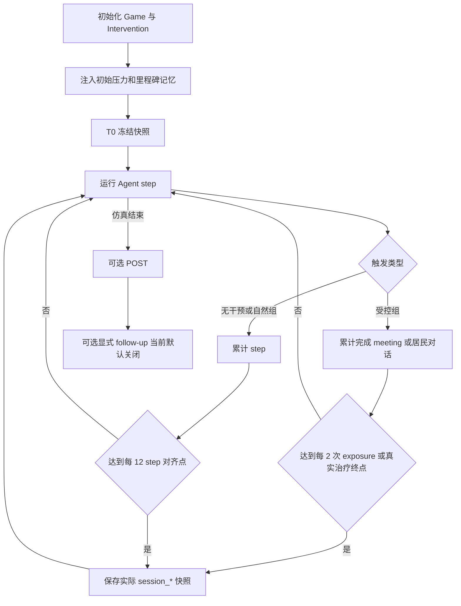
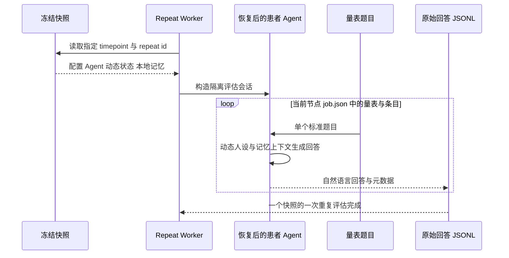
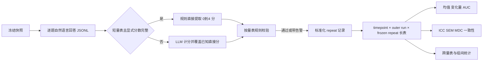
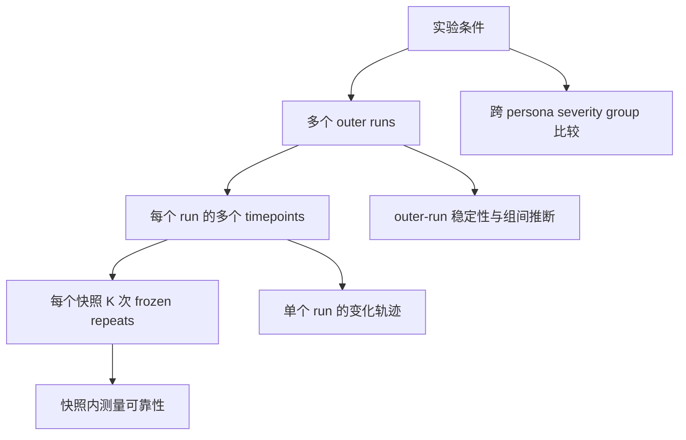

# 长短量表与重复评估流程

> 核对基线：2026-09-08（代码 `7aa4469`）。当前默认评估模式是 `capture_only`：仿真阶段冻结状态，之后按节点记录的量表集合进行归档复评。

[返回总览](00_overview.md) · [实验条件](01_experimental_conditions.md) · [结果与图表](05_results_and_figures.md) · [代码映射](06_code_mapping_and_maintenance.md)

## 1. 为什么采用冻结快照评估

LLM Agent 的量表回答本身有生成随机性。如果每次评估都重新跑整个小镇，就无法分辨差异来自生活/治疗轨迹，还是来自同一状态上的测量波动。当前流程因此把两种重复分开：

- **Outer repeat**：重新运行整个仿真，反映环境、对话、行为和状态轨迹差异；
- **Frozen repeat**：固定同一个 checkpoint，多次完成同一量表，反映测量/生成波动。

统计推断中的独立样本单位原则上是 outer run；frozen repeats 用于 ICC、SEM、MDC、题目一致性等可靠性分析，不能扩充组间检验的 n。

## 2. 评估时间点如何触发

### 2.1 T0

T0 在第一次仿真 step 的 Agent `think` 之前捕获，但在 `intervention.on_step_start` 执行之后。因此默认的初始压力/里程碑记忆已经注入。准确口径是：

> 初始化干预记忆之后、患者第一次自主生活决策之前的基线状态。

### 2.2 接触计数触发

对 G1/G3/G5/G6/G7/G9 等受控接触组，系统优先根据已完成的居民对话或医生 meeting 数计数，当前每完成 2 次目标接触冻结一次，常用标签为：

- `session_2`
- `session_4`
- `session_6`
- `session_8`
- ……

这里的 session 是历史命名，实际含义是 exposure count。它不等于 CBT 的 `session1`、`session2.1` 等固定大纲节点。

若 CBT 目标 pair 在非 2 的整倍数 meeting 上完成，系统仍会补存 `session_<实际完成数>` 作为真实治疗终点，并给该节点分配长量表。常规间隔节点与真实终点因此不能只靠“偶数/奇数”推断，应读取 `job.json` 中的实际量表集合和触发元数据。

计数来源优先级是：居民调度完成数 → meeting 完成状态 → 旧 session-eval 历史回退。分析中应保留触发来源字段。

### 2.3 Step 触发

G2 和 G10–G12 没有稳定的受控 meeting 数，overlay 改用每 12 step 冻结一次，并以 `virtual_session_interval=2` 生成标签。这只用于时间对齐，不代表发生了 2 次真实接触。当前新建端到端 72-step 工作流在 step 12/24/36/48/60/72 对齐为 `session_2/4/6/8/10/12`；96-step 恢复工作流还会对齐到 `session_16`；直接 Python 批处理若采用其 120-step 源码默认，则会对齐到 `session_20`。

### 2.4 POST、T4 与 follow-up

- `POST` 可由单次实验后处理在仿真结束后生成；
- T4 配置接口存在，但当前默认关闭；
- shell 工作流支持创建带 parent lineage 的后续无干预阶段，但默认 follow-up 关闭；新建工作流默认从 `session_12` 接力，恢复工作流仍默认从 `session_16` 接力。两者都必须在启用前确认源 run 确有对应 staged 节点。

因此常规结果中的末次 `session_*` 或 `POST` 不是自动意义上的长期随访。只有 manifest 明确记录父运行和延迟阶段时，才能称为 follow-up。不同提交下的 72/96/120-step 运行可能具有不同观察窗、评估间隔、量表 schema 和 controller，不能因步数相同就合并，也不能把旧标签缺失当作普通缺失值补齐。

## 3. 快照保存了什么

分阶段评估 bundle 不只是一个分数文件，而是可恢复的运行状态，主要包括：

- 捕获时的运行配置和触发元数据；
- Agent checkpoint 与完整本地存储副本/manifest；
- 对话状态和动态抑郁状态，包括恢复后保持不变的病例级 `core_belief`；
- 内容 hash，用于确认冻结对象没有被静默替换；
- group、persona、severity、controller 等可用 provenance。

rolling resume checkpoint 与 staged evaluation snapshot 目的不同：前者用于中断恢复，后者用于固定测量状态。两者不应混为同一种重复实验。

## 4. 节点级量表集合与作答流程

当前协议定义四个模板：

- **PHQ-9-v2**：9 个条目；
- **BDI-II-v2**：21 个条目；
- **总体抑郁水平及干扰程度量表**：5 个条目，每题 0–4，总分 0–20；
- **总体焦虑水平及干扰程度量表**：5 个条目，每题 0–4，总分 0–20。

`use_short_scales_for_intermediate_eval=true` 时，T0、T4、POST、明确的治疗完成节点或实际节点列表的首尾使用 PHQ-9/BDI-II；其他 staged 节点使用两套短量表。在线 capture 阶段可能尚不知道当前快照会成为实际末节点，因此最终量表集合以仿真结束后的 summary 与复评任务规划为准，不能只读取在线生成的旧 `job.json.scales`。

离线 worker 从冻结快照恢复目标 Agent，对每个题目调用 `ChatSession.answer_without_memory` 生成自然语言答案。当前实现每题只构造“当前题目”这一轮临时对话，不追加普通聊天记忆，也不调用动态患者的事件 commit/阶段转移；因此后续题目不会显式继承上一题答案，PHQ-9 也不会通过状态提交改变随后 BDI-II 的起点。

这个口径减少了题序和会话记忆污染，但与真实量表访谈不同：患者不能利用上一题建立的语境，每题都在同一冻结状态上独立解释。代码未来若调整 `_generate_chat_forced_then_fallback` 或 `answer_without_memory`，应以状态 hash 回归测试确认仍无隐式写入。

量表答案仍会使用恢复后的动态人设和本地记忆检索，因此它测量的是冻结时完整 Agent 状态，而不是只把一段静态 persona 填入问卷。

## 5. 从原始回答到量表结果

长量表回答由 `run_score_worker.py` 调用 ExpertLLM/DeepSeek 计分 Prompt，将自然语言解释为每题 0–3 分、总分、严重度和安全字段。短量表采用混合计分：

1. 每题先用规则提取患者明确选择且无冲突的 0–4 分；
2. 五题均可直接提取时完全跳过 ExpertLLM，记为 `direct_answer_regex_only`；
3. 有未解析题时调用 ExpertLLM，并用已直接提取的分数覆盖对应 LLM 条目，未解析题标为 `llm_fallback`；
4. 输出保留 `scoring_mode`、每题 `score_source`、直接提取数和覆盖数，便于审计。

随后规则校验器按具体量表 schema 执行：

- 题数是否为 9、21 或 5；
- 每题是否在对应的 0–3 或 0–4；
- 题目求和是否等于报告总分；
- 对定义了严重度阈值的长量表，分类是否符合总分；短量表当前输出“未设置分级”；
- PHQ-9 第 9 题与安全字段是否一致；
- 重复/聚合记录之间是否自洽；
- 显式分数文本与 LLM 提取是否冲突。

规则校验能识别结构错误和一部分解释冲突，但不能证明 LLM 计分等同于临床人工评分。论文中应分别报告“生成回答”和“LLM 解释评分”的不确定性。

## 6. 重复评估结构

典型端到端 shell 工作流为每个条件运行 outer repeats，并以 `labels=auto` 从原始 summary 选择实际 staged 节点，而不是硬编码一组标签。T0/真实终点等 PHQ-9/BDI-II 节点默认做 10 次 frozen repeats，中间两套短量表节点默认做 5 次；每个节点沿用原始 `job.json.scales`。因此 K 随量表/节点而变，可靠性统计必须读取 `expected_repeats`。

提交 `6264bcf` 新增的 `tmp_watch_0907_session12_then_repeat_eval.py` 是只服务三项 0907 在途运行的临时运维接力脚本：它验证 T0–`session_12` 快照完整性，并只在 `--execute` 下终止精确匹配的仿真进程后启动归档复评。它沿用长 10/短 5 次、controller manifest 校验、断点续跑和默认清理策略，但不是通用实验入口，也不应写成评估协议的新默认。

| 层次 | 变化了什么 | 保持了什么 | 主要回答的问题 |
|---|---|---|---|
| Frozen repeat | LLM 采样/作答与计分随机性 | 同一仿真快照 | 同一状态测量有多稳定？ |
| Outer repeat | 整个小镇和对话轨迹 | 条件配置 | 条件效果跨独立运行是否稳定？ |
| Persona | 长期背景与压力情境 | 组别/严重度等设计因素 | 效果能否跨患者背景泛化？ |
| Severity | 初始症状与动态配置 | persona/组别 | 不同初始严重度是否有异质效应？ |
| Group | 接触主体、内容、CBT/记忆操作 | 同批基础配置 | 干预条件之间有何差异？ |

## 7. 当前可靠性与一致性指标

`experiment_eval` 当前可计算：

### 7.1 冻结重复可靠性

- ICC(A,1)：单次绝对一致性；
- ICC(A,K)：K 次均值的绝对一致性；
- SEM 与 MDC95；
- repeat 内 SD；
- 严重度 category flip rate；
- exact agreement；
- 评分/分类 entropy。

ICC 必须同时报告估计值、区间、对象数、重复数和失败/退化情况；不能只给一个看似很高的数。

### 7.2 题级一致性

- 线性/二次加权 Cohen's kappa；
- item、repeat、entity 等不同聚合层次；
- outer-run cluster bootstrap，在 cluster 数足够时作为主要区间。

### 7.3 同节点量表收敛

- 同一时间点总分的 Spearman 相关；
- 从基线到后续时间点的变化方向一致率；
- cluster-bootstrap CI 为主要区间，naive p-value 仅作探索性参考。

PHQ-9 与 BDI-II 只在长量表节点比较；两套短量表只在中间短量表节点比较。短量表分数不能填入 PHQ-9/BDI-II 的缺失槽位，也不能直接拼成同一原始分轨迹。这些指标说明同节点的两个仿真量表是否给出相近方向，不等于建立临床效标效度。

## 8. API 调用与成本归属

新运行将 DeepSeek 调用写入 `results/experiment_data/api_cost/<run>/calls.jsonl`，并生成 `summary.json`。仿真、staged/POST、T0 与归档复评 worker 会传递同一 run、phase、evaluation ID 和 scale name；摘要可按 simulation/repeat_evaluation、caller 模块和量表单元统计缓存命中/未命中 token、reasoning/可见输出 token、失败、缺失 usage、费用及完整性告警。

历史 worker 日志可用 `runshells/backfill_api_cost_from_logs.py` 回填部分“强制量表答题缓存记录”，但回填的请求时间和峰谷价格档位属于带 provenance 的推断，不能与原生账本同等看待。成本只覆盖识别为 DeepSeek 的调用，不是本地 vLLM、embedding 和机器资源的总成本。

## 9. 跨时间、跨组和跨人设比较

当前统计层支持：

- 描述统计：mean、SD、median、IQR、t-based CI；
- 个体/组轨迹、基线到终点 delta、AUC、rebound；
- Welch 检验与 Hedges g；
- 只有存在明确配对 metadata 时才使用 paired 方法；
- baseline-adjusted ANCOVA；
- group × time contrasts；
- outer-run cluster bootstrap；
- persona leave-one-out、方差分解与异质性展示。

当前未建立严格的同 seed 跨组配对设计，因此不能仅因 persona/severity 相同就把两次 outer run 当配对样本。

## 10. 安全与解释边界

- PHQ-9 item 9 和聚合安全字段可作为风险 proxy，但没有人工金标准时不能报告真实世界 sensitivity/specificity。
- 四套量表结果都来自生成式患者；除完全直接提分的短量表外还包含生成式计分器，属于系统行为测量，不是临床诊断。
- frozen repeats 高一致性只说明同一仿真状态的测量稳定，不说明治疗有效。
- outer run 数量通常较小。即使长量表有 10 次、短量表有 5 次重复，也不能把这些次数当成组间 n。
- 严重度文件控制初始状态，但 T0 是否完全满足目标分层应由实际量表结果审计，而不是从文件名推定。

## 11. 待确认与建议修订

1. 为每道题作答前后的 Agent/dynamic state 增加 hash 回归测试，防止未来代码改动引入隐式写入；
2. 评估“逐题无历史”与“保留量表上下文”的 context ablation，明确主协议为什么选前者；
3. 给 frozen repeat 与 outer repeat 使用更直白的中文/图表标签；
4. 把 `session_*` 在报告层按触发来源重命名为 `exposure_*` 或明确的 step 对齐标签，同时保留原始字段以兼容数据；
5. 增加人工抽样计分或双模型计分，量化 LLM scorer 的解释误差；
6. 明确 T4/follow-up 的真实时间间隔与父运行规则后再纳入主分析；
7. 持续校验非治疗 step 对齐组的“最终 staged 长量表”策略；72-step 主工作流应到 `session_12`，96-step 恢复工作流应到 `session_16`，并由汇总/复评阶段依据实际节点列表把末节点强制归为 PHQ-9/BDI-II。
