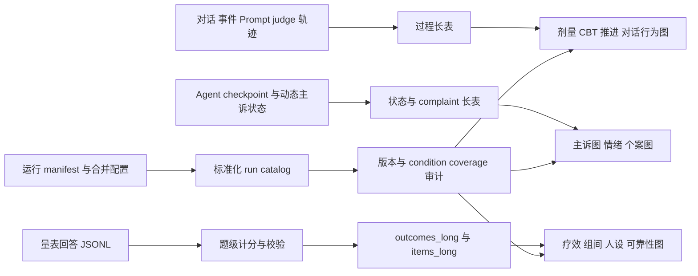

# 当前可计算结果、论文图表与数据缺口

> 核对基线：2026-08-23。本文区分“代码支持”“当前存档中已看到所需接口”和“覆盖足够形成结论”。能运行绘图代码不代表样本量或版本可比性已经满足论文推断。

[返回总览](00_overview.md) · [实验条件](01_experimental_conditions.md) · [评估](04_evaluation.md) · [代码映射](06_code_mapping_and_maintenance.md)

## 1. 当前结果存档概况

`results` 当前链接到独立存储，主要可见：

- `0802 & 0808`：较早的联合归档、标准化分析接口和大量已有图；包含 KBD2 的多个组以及 G1 的部分跨 persona 结果；
- `0818-g1-2-4-5-6-11`；
- `0819-g1-2-4-5-6-9-11`；
- `0820-g1-2-4-5-6-9-11`；
- `0821-g1-2-4-5-6-9-11`；
- `0822-g1-2-4-5-6-11`；
- 当前活动中的 `checkpoints/`、`experiment_data/`、`scale_context_ablation/` 等。

从报告文件数和命名看，0818 常见为每条件 3 个 outer runs，0819–0821 覆盖 7 个命名条件，0822 存档数量并不完全齐整；这些只是存档盘点，不替代 manifest 校验。当前结果覆盖远小于代码可解析的 270 个主条件。

较早联合归档已经生成过以下标准化接口：

- archive run catalog；
- outcomes long、items long；
- baseline features；
- follow-up lineage；
- engagement events/coverage；
- condition coverage 与 availability/manifest；
- complaint interval/run alignment。

由于近期代码和 Prompt 多次变化，所有跨日期汇总都必须先比较 controller identity、config digest、Prompt/模型版本、时间步和评估 schema。没有充分 provenance 的结果只能作探索性附录或 case study。

## 2. 从原始记录到图表的接口

建议每次分析先生成 coverage 表，再生成图。coverage 至少列出 group、persona、severity、controller、outer runs、timepoints、每快照 repeats、方法版本和缺失原因。

## 3. 论文主图的建议优先级

遵循 `experiment_eval/README.md` 的报告导向政策：默认只生成约 10–20 张、最多 30 张规范图；不默认展开 `by_repeat` 或旧版“所有图”；同一 outer run 单元先池化 frozen repeats；manifest 中记录哪些图没有生成及原因。

建议主文优先：

1. 条件 coverage 与分析样本流程图；
2. PHQ-9/BDI-II 组别轨迹；
3. 基线校正后的终点组间效应；
4. frozen repeat 可靠性图；
5. PHQ-9/BDI-II 收敛图；
6. CBT delivery/subgoal 或主诉阶段过程图；
7. 跨 persona 异质性图；
8. 一个可追溯的 case study 时间线。

其余题级、网络、SHAP 和大量诊断图放补充材料。

## 4. 治疗效果

### 当前已有数据即可画

| 图/表 | 所需数据 | 横轴 | 纵轴/指标 | 回答的问题 | 注意 |
|---|---|---|---|---|---|
| 症状轨迹图 | outcomes long，T0 与后续点 | exposure/timepoint | PHQ-9 或 BDI-II pooled mean 与 outer-run CI | CBT 后症状是否随时间下降？ | frozen repeats 先在 outer cell 内汇总 |
| 基线到终点变化图 | T0 与可比终点 | group 或 outer run | delta score 与 CI | 终点改善幅度多大？ | 终点必须同口径；POST 不与 session_12 混称 |
| AUC/反弹图 | 至少 3 个时间点 | group | trajectory AUC、末段 rebound | 改善是否持续，是否后期反弹？ | step 对齐组与 exposure 对齐组需注明 |
| Endpoint waterfall | outer-run 级 delta | 排序后的 run/persona | 个体 delta | 改善是否由少数 run 驱动？ | 适合展示异质性，不代替推断 |

现有 0818–0822 的 G1 与若干对照批次具备量表汇总；早期联合归档也已产生 trajectory、endpoint delta 和 consistency 图。但合并前必须完成版本审计。

### 需要新增运行或记录

- 真正长期维持/复发图需要启用并完成有明确延迟的 T4/follow-up；
- 严格“同一随机轨迹下有/无 CBT”反事实需要 seed 控制和配对 manifest；
- 临床最小重要差异不能仅凭仿真结果自行定义，需要外部依据或预注册阈值。

## 5. 不同实验组比较

### 当前已有数据即可画

| 图/表 | 数据 | 指标 | 研究问题 |
|---|---|---|---|
| Group × time 轨迹 | 同版本多组 outcomes | 组别均值与 CI | CBT、支持、中性/负向/正向和无干预的轨迹是否不同？ |
| 基线校正效应森林图 | outer-run 级终点 + baseline | ANCOVA contrast、Hedges g | 在校正 T0 后，G1 相对各对照的差异多大？ |
| 条件 × 量表热图 | group × timepoint × scale | 标准化变化或 delta | 哪些条件在两个量表上都改善/恶化？ |
| 强制 vs 自然暴露图 | G3/G5/G9 与 G10/G11/G12 | 实际剂量、每次 exposure 后变化 | 接触调度方式是否影响结果？ |
| CBT vs 支持性 | G1 vs G6 | 症状变化、会面次数、对话长度 | 结构化 CBT 是否超过一般支持性医生接触？ |
| 记忆消融 | G1 vs G7 | 症状、主诉推进、咨询连续性 | 通用记忆写入对治疗连续性是否重要？ |

现实 coverage 限制：新批次集中在 G1/G2/G4/G5/G6/G9/G11；G3/G7 多在较早归档；G10/G12 没有看到与主批次相当的完整存档。因此“当前所有 10 主组总比较”还不能直接完成。

G4 应单独标为咨询室 setting。若比较 G1 vs G4，回答的是“完整小镇与两角色咨询室的综合差异”，不是单一治疗成分效应。

### 需要新增运行或设计

- 补齐同一代码版本下的 G3/G7/G10/G12；
- 若要把强制与自然暴露解释为调度效应，应匹配真实对话剂量、居民身份和时间；
- 若要做完全平衡 factorial，需要补齐 persona × group × severity，并预先定义主效应与交互。

## 6. 跨人设与严重度

### 当前已有数据即可画

早期联合归档包含 G1 的部分跨 persona 结果，并已有 baseline feature、cross-persona、persona heatmap/contrast 等接口，可画：

- persona 分面轨迹：横轴 timepoint，纵轴量表分，颜色为 persona；
- persona × outcome 热图：行 persona、列 PHQ/BDI/过程指标；
- leave-one-persona-out forest：每次去掉一个 persona 后的 G1 效应；
- treatment response profile：每个 persona 的 baseline、delta、CBT delivery 和 complaint change；
- variance partition：persona、outer run、frozen measurement 等层次的方差比例。

这些图当前更适合作为“已覆盖 persona 的异质性探索”，不能声称代表全部 KBD1–KBD9 × 三严重度。

### 需要新增数据

- 完整跨 persona 泛化需要同版本、同组别和相同 outer repeat 数；
- severity 交互需要 mild/moderate/severe 的平衡运行，而不是主要依赖 severe 存档；
- SHAP/特征预测虽有脚本和旧图，但稳定解释需要更多 outer-level 独立样本、固定 feature schema 和防止数据泄漏的交叉验证。

## 7. 重复实验稳定性

### 当前已有数据即可画

| 图 | 横轴 | 纵轴 | 含义 |
|---|---|---|---|
| Outer-run trajectory spaghetti | timepoint | 每个 outer run 的 pooled score | 同条件独立仿真轨迹是否一致 |
| Outer-run delta forest | outer run/条件 | delta 与区间 | 条件效果是否由单个 run 驱动 |
| Frozen-repeat distribution | repeat 或 score bin | 同快照总分分布 | 同一状态的测量波动 |
| ICC/SEM/MDC panel | scale × timepoint × condition | ICC、SEM、MDC95 | 单次测量与 K 次均值的可靠性 |
| Severity flip/entropy heatmap | condition × timepoint | flip rate/entropy | 临界严重度分类是否不稳定 |

0818–0822 多批次和 repeat summary 已经具备这些计算所需的基础；早期归档也已有 repeat uncertainty、batch consistency、reliability heatmap 等图。

### 解释规则

- frozen repeat 只能作为同一对象的重复测量；
- outer run 才能进入组间 n；
- 当 outer clusters 少于 5 时，cluster bootstrap 区间不稳定，应报告精确 cluster 数并降低推断强度；
- 不默认输出每个 repeat 的全套图，以免视觉上伪造样本量。

## 8. PHQ-9/BDI-II 一致性与可信度

### 当前已有数据即可画

- 总分散点：横轴 PHQ-9、纵轴 BDI-II，颜色为 timepoint/group，报告 Spearman 与 cluster-bootstrap CI；
- 变化方向一致图：两量表 delta 的四象限/一致率；
- 题级 weighted kappa forest；
- item score heatmap 与症状小 multiples；
- 计分校验失败/告警表；
- PHQ item 9 与安全字段一致性表。

这些图回答“两个生成式量表是否同向、重复是否稳定、计分是否自洽”。它们不能回答真实临床诊断准确率。

### 需要外部新增数据

- 临床专家盲评或真实患者基准，才能讨论 criterion validity；
- 人工题级复评分，才能估计 LLM scorer 的 precision/agreement；
- context ablation 或外部复核，才能判断当前“每题无历史、同一冻结状态”的测量口径是否比连续访谈更可信；当前代码没有显式的逐题动态状态提交。

## 9. 主诉图与 CBT 推进过程

### 当前已有数据即可画

动态 LLM trace、Agent checkpoint、judge/session eval 和 Progressive control 日志支持：

| 图 | 数据 | 横轴/结构 | 纵轴/指标 | 研究问题 |
|---|---|---|---|---|
| 主诉阶段时间线 | stage history/transition trace | 时间或 meeting | stage id、变化类型 | 患者在何时出现何种证据驱动变化？ |
| 主诉转移 Sankey/有向图 | selected transitions | stage/候选关系 | 流量=run 数 | 多个 run 是否出现相似路径？ |
| 保持/推进率 | change detector 与 transition | session/timepoint | hold、change、advance 比例 | 状态机是否过度停滞或过度推进？ |
| CBT session stay length | session manager history | 固定 session | meeting 数/轮数 | 哪些治疗节点最难完成？ |
| Judge terminate 与 session_end 对照 | judge + evaluator | meeting | terminate、最终推进 | 轮内结束与疗程完成是否被正确区分？ |
| Progressive subgoal heatmap | control result | meeting × subgoal | none/partial/complete | 哪些子目标逐步完成？ |
| 医嘱—环境任务链 | order/task events | 时间线 | 建议、执行、结果、记忆 | 治疗是否进入日常行为？ |

早期分析目录已有 complaint interval/run alignment 和过程类图接口。Progressive subgoal 图只适用于 manifest 确认使用原生 Progressive D 的运行；不能从 Legacy 数据反推。

### 需要更强数据或标注

- “主诉图变化导致症状改善”的中介分析需要足够 outer runs、预先定义时间窗和混杂控制；当前只能做描述性时序关联；
- 主诉节点语义相似度/质量需要人工编码或独立评审；
- domain-state 轨迹当前默认关闭，不能作为常规过程指标。

## 10. 对话、行为与其他过程指标

### 当前已有数据即可画

- intervention dose：meeting 数、完成数、总轮次、对话长度；
- delivery fidelity：当前 session Prompt 是否注入、judge/evaluator 是否成功、session 是否推进；
- engagement：患者响应长度、拒绝/投入 tracker、对话覆盖率；
- 居民 exposure：居民身份、极性、强制/自然、真实发生次数；
- 行为：地点、日程、环境任务结果、反思触发；
- 记忆：写入类型、G7 拦截计数、检索覆盖；
- 模型调用：动态人设/CBT 判断轨迹中的成功、失败、fallback 与调用数。

推荐图：剂量—反应散点、meeting funnel、Prompt delivery heatmap、对话轮数分布、居民 exposure 堆叠图、环境任务时间线。过程指标需要由事件 coverage 表先确认不同批次是否都记录了相同字段。

### 当前不足

- 精确 token、费用和端到端 latency 不一定在所有旧运行完整记录；
- “情绪推断准确率”没有外部标签；
- 自然对话的关系质量或伤害程度没有独立人工标注；
- 旧存档可能缺少统一的 memory block/reflect reason 字段。

## 11. Case study

当前记录足以构建单个 outer run 的可审计个案：

1. persona 与严重度基线；
2. T0 量表及重复分布；
3. 每次医生/居民接触的关键原话短摘录；
4. 当前 CBT session、judge 建议和推进原因；
5. 主诉 stage 的证据、候选与选择；
6. 医嘱、环境任务、生活行为和反思；
7. PHQ-9/BDI-II 轨迹和题级变化；
8. 最终状态与限制。

个案应优先选择 provenance 完整、量表校验通过、对话/过程日志齐全且不是极端异常的 run；同时可在补充材料另列失败个案。引用对话时控制长度，并明确它是模型生成文本。

## 12. “现在能画”与“未来才能画”总表

| 主题 | 当前状态 | 主要前置条件 |
|---|---|---|
| G1 疗效轨迹与若干对照比较 | 可直接计算 | 同版本过滤、outer-level 聚合 |
| G1/G2/G4/G5/G6/G9/G11 多组图 | 多个新批次可做 | 检查每批 coverage 与缺失 |
| 全部 10 主组比较 | 暂不可完整完成 | 补齐 G3/G7/G10/G12 同版本运行 |
| 跨 persona | 可做部分探索 | 限定旧归档已覆盖 persona |
| mild/moderate/severe 完整交互 | 数据不足 | 平衡补跑三严重度 |
| frozen repeat 可靠性 | 可直接计算 | 保留快照层级，不能伪增 n |
| PHQ/BDI 收敛 | 可直接计算 | 报告逐题无历史口径及 scorer 限制 |
| 主诉图/CBT 过程 | 可直接做描述分析 | 按 controller 与日志版本分层 |
| Progressive subgoal 机制 | 仅对 progressive runs 可做 | 足够原生 Progressive D 运行 |
| 长期随访/复发 | 当前常规数据不足 | 开启显式 parent-linked follow-up |
| seed 配对反事实 | 当前设计不足 | 记录并控制相同随机 seed |
| 临床效度/安全准确率 | 不能由现有数据回答 | 外部人工/临床金标准 |
| 稳健 SHAP 与机制预测 | 脚本可画但证据不足 | 更大 outer n、固定特征和交叉验证 |

## 13. 每次出图前的检查清单

1. 是否先读 run manifest，而非只看目录名；
2. controller、Prompt、config digest、模型和步长是否可比；
3. outer run 与 frozen repeat 是否分层正确；
4. T0/session_4 等触发来源是 exposure 还是 step；
5. 缺失 timepoint 是否被透明报告；
6. G4 是否单独标注为咨询室 setting；
7. follow-up 是否真有 parent lineage 与延迟；
8. 量表校验告警是否排查；
9. 主文图是否保持紧凑，未生成图及原因是否进入 manifest；
10. 结论是否限定为 in-silico，不外推临床疗效。
