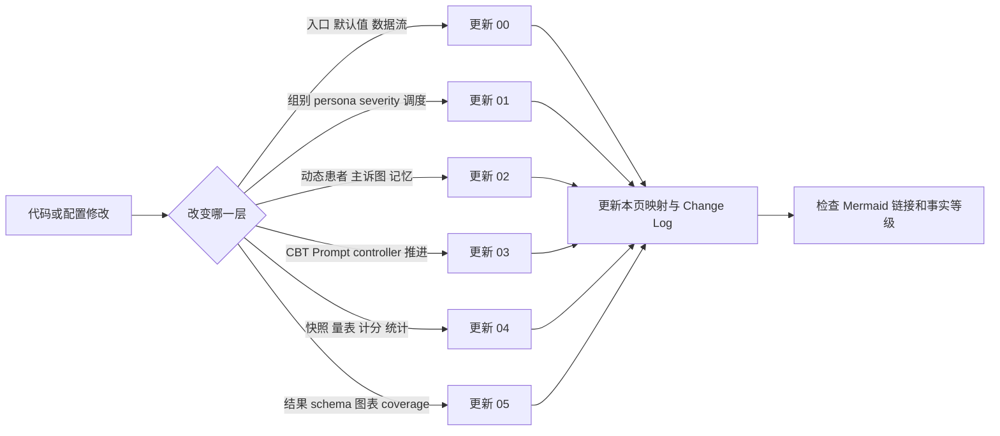
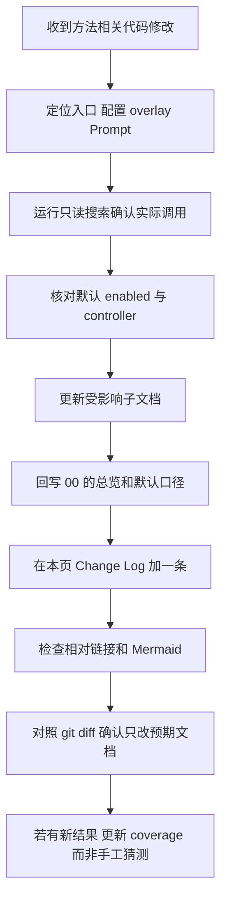

# 代码映射、证据入口与文档维护

> 核对基线：2026-08-23。本页不是逐文件说明，而是以后方法变化时最值得优先检查的“证据地图”。

[返回总览](00_overview.md) · [实验条件](01_experimental_conditions.md) · [动态人设](02_depression_persona.md) · [CBT](03_cbt_pipeline.md) · [评估](04_evaluation.md) · [结果](05_results_and_figures.md)

## 1. 维护原则

1. 先读入口和合并后的配置，再读旧文档；
2. 配置中的 `enabled`、controller override 和组别 overlay 共同决定真实路径；
3. 文件存在不等于当前启用，Prompt 存在也不等于进入当前 session 顺序；
4. 结果方法以每个 run 的 manifest/config digest 为准，目录名只作索引；
5. 任何改变默认参数、状态更新、评估触发或输出 schema 的提交，都应在同一提交更新对应 md 与 Change Log；
6. 不在本文档目录复制大段配置，避免代码改后出现第二份事实源。

## 2. 总运行与 Agent 生活

| 位置 | 以后重点查什么 | 对应文档 |
|---|---|---|
| `start.py` | 每 step 的真实顺序、T0 时机、干预回调、快照/事件/最终输出 | 00、04 |
| `modules/game.py` | 地图和角色加载、全局配置如何注入 Agent、InterventionManager 连接 | 00 |
| `modules/agent.py` | think 主循环、移动/日程/感知/对话/反思、动态患者 preview/commit、咨询室 lite | 00、02、03 |
| `modules/maze.py` 及地图资产 | 小镇空间与咨询室环境 | 00、01 |
| `modules/memory/` | 通用事件/思考/聊天记忆结构与检索 | 02 |
| `modules/simulation_event_recorder.py` | 过程事件 schema 与 coverage | 04、05 |
| `data/config.json` | 当前默认模型、干预、反思、checkpoint、staged eval | 全部，尤其 00 |
| `data/config_counsel_room.json` | G4 咨询室覆盖项与 lite 运行 | 01 |

## 3. 实验组、Persona 与运行脚本

| 位置 | 以后重点查什么 | 对应文档 |
|---|---|---|
| `experiments/config/groups/*.json` | G1/G2/G3/G5/G6/G7/G9/G10/G11/G12 真正覆盖的开关 | 01 |
| `experiments/config/personas/` | persona 选择器与角色资产映射 | 01、02 |
| `experiments/config/severity/` | mild/moderate/severe 覆盖 | 01、02、04 |
| `experiments/config/phases/post_sim_followup_no_intervention.json` | follow-up 阶段到底关闭了什么 | 01、04、05 |
| `runshells/run_batch_experiment.py` | GROUPS 注册、组合生成、默认 step/stride/controller | 00、01 |
| `runshells/cbt_experiment_config.py` | overlay 深合并、controller override、manifest 身份 | 01、03 |
| `runshells/kabuda_variant_runtime.py` | KBD1–KBD9 规范化为卡布达、资产替换 | 01、02 |
| `runshells/run_one_experiment.py` | 单次仿真后的复制、POST 量表、合并和压缩 | 00、04 |
| `runshells/run_batch_then_repeat_eval.sh` | 主工作流、outer repeat、frozen repeat、timepoint、follow-up 开关 | 01、04 |
| `runshells/run_resume_batch_then_repeat_eval.sh` | 续跑工作流与重复评估连接 | 01、04 |
| `runshells/run_post_sim_followup.py` | parent-linked follow-up 创建 | 04、05 |

组别方法发生变化时，应同时保存一份合并后的运行配置或 config digest。只改 overlay 而不更新方法版本，会让历史同名 G1 失去可比性。

## 4. 动态抑郁人设

| 位置 | 职责/需核对内容 | 对应文档 |
|---|---|---|
| `modules/depression/engine.py` | preview/commit 总入口、序列化、domain window 可选路径 | 02 |
| `modules/depression/state_machine.py` | 根主诉、change detector、planner、transition、路径与防循环 | 02 |
| `modules/depression/context_analyzer.py` | 场景、话题、言语行为、立场与 flags | 02 |
| `modules/depression/emotion_inferencer.py` | 即时情绪 LLM、fallback、波动限制 | 02 |
| `modules/depression/prompt_builder.py` | 长期/阶段/情境/情绪的 Prompt 分层和 graph window 可见性 | 02 |
| `modules/depression/memory_system.py` | depression 内部 trauma memory 是否真正启用 | 02 |
| `data/prompts/depression/graph_transition_change.txt` | 变化证据的定义 | 02 |
| `data/prompts/depression/graph_planner.txt` | 候选节点生成规则 | 02 |
| `data/prompts/depression/graph_transition.txt` | 候选选择与推进 | 02 |
| `data/prompts/depression/emotion_inferencer.txt` | 即时情绪输出规范 | 02 |
| `data/prompts/depression/dynamic_prompt_layers.txt` | 患者可见信息层次 | 02 |
| `data/prompts/depression/depression_prompt_config.json` | 动态 Prompt/图机制开关 | 02 |
| `frontend/static/assets/village/agents/卡布达*/depression_config_*.json` | persona × severity 的根主诉、初始 stage、planner/emotion/memory 配置 | 02 |
| `frontend/static/assets/village/agents/卡布达*/scratch.json` 等角色资产 | 基础身份、生活背景、初始记忆 | 02 |

检查主诉机制时要同时读 `modules/agent.py` 中 preview 和 commit 的调用位置。只读 `modules/depression/` 不能确认患者回复后是否真的提交。

## 5. 干预与 CBT

| 位置 | 职责/需核对内容 | 对应文档 |
|---|---|---|
| `modules/intervention_manager.py` | 会面队列、轮内 judge/tracker/router、会后 evaluator、医嘱/任务、controller 分支总编排 | 01、03 |
| `modules/session_prompt_injection_manager.py` | 固定 session 顺序、当前 session、Prompt 注入与推进 | 03 |
| `modules/resident_chat_scheduler.py` | G3/G5/G9 的调度、居民选择与完成计数 | 01、04 |
| `modules/memory_injection_manager.py` | 初始压力、里程碑和 session memory 规则 | 02、04 |
| `modules/intervention_consult_record.py` | consult history/record 的可选记录 | 03 |
| `data/prompts/intervention/dialog_judge_legacy.txt` | Legacy 轮内治疗判断；基础配置/直接 Python 入口默认 | 03 |
| `data/prompts/intervention/dialog_judge_patient_state_summary.txt` | Legacy 患者状态压缩 | 03 |
| `data/prompts/intervention/state_tracker.txt` | Minimal 可观察状态 | 03 |
| `data/prompts/intervention/state_tracker_progressive_d.txt` | Progressive 内部状态读取 | 03 |
| `data/prompts/intervention/dialog_judge.txt` | Minimal judge | 03 |
| `data/prompts/intervention/dialog_judge_progressive_d.txt` | Progressive judge | 03 |
| `data/prompts/intervention/session_eval_legacy.txt` | Legacy 会后推进 | 03 |
| `data/prompts/intervention/session_eval.txt` | Minimal 会后证据评估 | 03 |
| `data/prompts/intervention/control_eval_progressive_d.txt` | Progressive 批量 subgoal 评估 | 03 |
| `data/intervention/cbt_strategy_map.json` | session 到候选策略映射 | 03 |
| `data/intervention/cbt_stage_subgoals.json` | Progressive 宏观阶段与 subgoal | 03 |
| `data/intervention/cbt_term_glossary.json` | 结构化术语约束 | 03 |
| `data/prompts/intervention/supportive_counseling_doctor.txt` | G6 支持性医生内容 | 01 |
| `data/prompts/intervention/resident_chat_*.txt` | 中性/负向/正向居民内容 | 01 |
| `data/prompts/intervention_prompts.json` | 固定 CBT session Prompt 与当前顺序引用 | 03 |
| `data/prompts/extract_doctor_order.txt` | 会后医嘱提取 | 03 |
| `data/prompts/intervention/environment_task_outcome.txt` | 环境任务结果生成 | 03 |

带“备份”后缀的 Prompt 以及未进入 `session_order` 的 Prompt 不属于当前正式流程。修改 Prompt 时建议记录内容 hash 或方法版本；只记录文件名不足以区分历史运行。

## 6. 评估、计分与统计

| 位置 | 职责/需核对内容 | 对应文档 |
|---|---|---|
| `modules/staged_eval_manager.py` | T0、meeting/exposure/step 触发、capture_only、快照 bundle | 04 |
| `runshells/scale_protocol.py` | PHQ-9/BDI-II 模板和评估协议 | 04 |
| `runshells/run_staged_eval_worker.py` | 从 staged snapshot 恢复并逐题作答 | 04 |
| `runshells/run_archived_repeat_scale_eval.py` | 归档快照的 K 次重复评估 | 04 |
| `runshells/run_t0_repeat_eval.py` | persona/severity 的 T0 重复评估 | 04 |
| `runshells/run_score_worker.py` | LLM 题级计分与总分/严重度生成 | 04 |
| `runshells/validate_scale_score_results.py` | 题数、范围、总分、严重度和安全一致性校验 | 04 |
| `runshells/run_frozen_scale_context_ablation.py` 及 worker | 量表上下文消融 | 04、05 |
| `experiment_eval/loader.py`、`schema.py` | 各归档格式归一化 | 04、05 |
| `experiment_eval/statistics.py` | 描述、检验、效应量、可靠性基础统计 | 04、05 |
| `experiment_eval/weighted_kappa.py`、`scale_credibility.py` | 题级一致性与跨量表可信度 | 04、05 |
| `experiment_eval/process.py`、`complaint_nodes.py` | 干预过程与主诉图指标 | 05 |
| `experiment_eval/cross_persona.py`、`persona_profile.py` | 跨 persona 分析 | 05 |
| `experiment_eval/charts/` | 当前 registry 化规范图 | 05 |
| `experiment_eval/compat/visualization/` | 旧图兼容层，不应默认全量展开 | 05 |
| `experiment_eval/README.md` | 图表选择政策、运行口径和已知限制 | 05 |

## 7. 输出文件与分析证据

| 输出位置/模式 | 内容 | 用途 |
|---|---|---|
| `results/checkpoints/<run>/` | 原始运行状态、对话、事件、Prompt/judge trace、staged bundles、resume 数据 | 机制审计与恢复 |
| `depression_dynamic_llm_trace.jsonl` | emotion/change/planner/transition 等动态调用 | 主诉图与失败率分析 |
| conversation/judge/forced-prompt traces | 实际对话和治疗决策链 | CBT fidelity 与 case study |
| staged eval snapshot bundle | 冻结 Agent、配置、本地存储与 hash | 重复量表评估 |
| `results/experiment_data/<run>/` | 后处理对话、量表、压缩与图表输入 | 单 run 分析 |
| `results/experiment_data/reports/` | batch/repeat summary | coverage 和批次统计 |
| `experiment_eval` 产出的 `outcomes_long`、`items_long` 等 | 标准化长表 | 跨 run 统计 |
| analysis manifest/availability/coverage | 数据纳入、排除和未生成图原因 | 可复现报告 |

真实文件名可能随脚本版本变化，应从 summary/manifest 中读取路径，不建议下游脚本硬编码某一日期目录。

## 8. 代码改动 → 文档同步表

| 如果修改了 | 必须复核/更新 | 最少记录内容 |
|---|---|---|
| `start.py` step 顺序或回调 | 00、04、Change Log | T0/状态提交/保存时机怎么变 |
| 基础 `data/config.json` 默认值 | 00，并按影响更新 01–05 | 旧默认、新默认、启用状态、原因 |
| 新增/修改 group overlay | 01、00 条件表、05 coverage | 改变量、继承变量、对照逻辑 |
| persona/severity 文件或映射 | 01、02、04 | 长期背景、初始状态、覆盖组合 |
| 动态 Prompt 层 | 02、个案解释 | 患者新增可见/不可见字段 |
| change/planner/transition | 02、05 | 证据门、候选数、推进/保持规则 |
| 记忆写入、检索或反思 | 02、G7 描述、过程指标 | 哪类状态受影响、默认是否启用 |
| session 顺序或 CBT Prompt | 03、00 | 新顺序、进入/退出正式流程的 Prompt |
| judge/tracker/router/evaluator | 03、05 | controller、输入输出、风险与推进门 |
| Progressive D adapter | 03 | action、subgoal、完成审计和版本号 |
| meeting/resident scheduler | 01、04 | 间隔、phase、对象、计数来源 |
| staged eval trigger | 04、00 | 基线时机、timepoint 语义、capture 模式 |
| 量表模板或计分 Prompt | 04、05 | 版本、题数、分值、校验和顺序 |
| outer/frozen repeat 脚本 | 01、04、05 | 独立单位、默认次数、目录结构 |
| `experiment_eval` schema/statistics | 04、05 | 新指标、聚合单位、CI/检验假设 |
| 图表 registry/默认 figure set | 05 | 主图、补图、停用图和原因 |
| 结果目录迁移或 provenance 字段 | 05、本页 | 新入口、兼容策略、可比性边界 |

## 9. 推荐的更新流程

建议每条 Change Log 至少写：日期、代码版本/commit、涉及模块、默认行为是否改变、兼容性、需要重跑哪些实验。若当前工作区未提交，可先写“workspace snapshot + 日期”，提交后补 commit。

## 10. Change Log

| 日期 | 版本/范围 | 方法变化 | 结果兼容性/后续动作 |
|---|---|---|---|
| 2026-08-23 | 当前 workspace snapshot | 首次按实际代码建立 `docs/town_method/`；确认基础配置/直接 Python 入口默认 Legacy、端到端 shell 预设 Progressive、evidence-first 动态主诉图、capture-only 分阶段快照和 frozen repeat 评估；区分主组与 G4 咨询室设置 | 0802–0822 归档需按 manifest/config digest/controller 分层；不能默认全部合并 |
| 待填写 | commit/tag | 描述默认方法或输出 schema 的变化 | 写明需补跑条件、是否兼容旧 checkpoint |

## 11. 当前文档仍需人工确认的项目

- persona/严重度文本的构建与专家审核来源；
- G4 的正式研究定位；
- 不同日期归档中哪些具有足够 provenance 可纳入同一主分析；
- scale item/scale 顺序是否要改为独立冻结副本；
- follow-up 的目标仿真时长与正式时间点命名；
- 是否建立统一 `method_version`，覆盖代码、配置、Prompt、量表和统计 schema。
