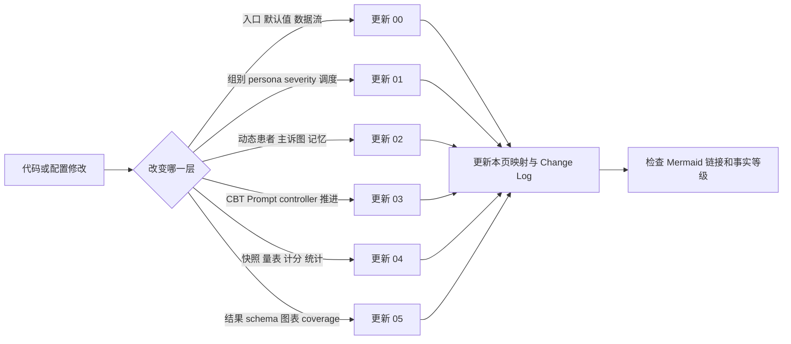
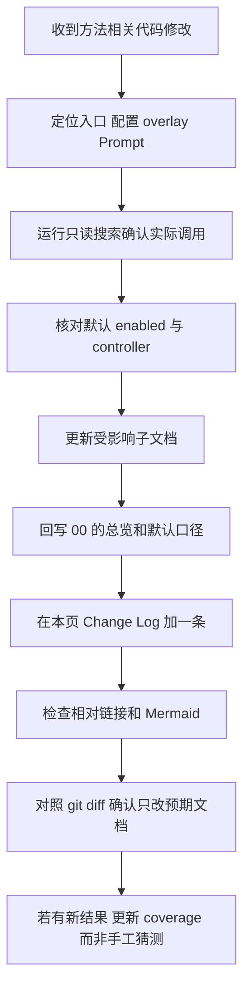

# 代码映射、证据入口与文档维护

> 核对基线：2026-09-08（代码 `7aa4469`）。本页不是逐文件说明，而是以后方法变化时最值得优先检查的“证据地图”。

[返回总览](00_overview.md) · [实验条件](01_experimental_conditions.md) · [动态人设](02_depression_persona.md) · [CBT](03_cbt_pipeline.md) · [评估](04_evaluation.md) · [结果](05_results_and_figures.md)

## 1. 维护原则

1. 先读入口和合并后的配置，再读旧文档；
2. 配置中的 `enabled`、controller override 和组别 overlay 共同决定真实路径；
3. 文件存在不等于当前启用，Prompt 存在也不等于进入当前 session 顺序；
4. 结果方法以每个 run 的 manifest/config digest 为准，目录名只作索引；
5. 任何改变默认参数、状态更新、评估触发或输出 schema 的提交，都应在同一提交更新对应 md 与 Change Log；
6. 不在本文档目录复制大段配置，避免代码改后出现第二份事实源。

## 2. 总运行与 Agent 生活

| 位置 | 以后重点查什么 | 对应文档 |
|---|---|---|
| `start.py` | 每 step 的真实顺序、T0 时机、干预回调、快照/事件/最终输出 | 00、04 |
| `modules/game.py` | 地图和角色加载、全局配置如何注入 Agent、InterventionManager 连接 | 00 |
| `modules/agent.py` | think 主循环、移动/日程/感知/对话/反思、动态患者 preview/commit、forced LLM 路由、会后咨询摘要、咨询室 lite、向 Judge 传递会谈最大轮数与执行硬上限 | 00、02、03 |
| `modules/maze.py` 及地图资产 | 小镇空间与咨询室环境 | 00、01 |
| `modules/memory/` | 通用事件/思考/聊天记忆结构与检索 | 02 |
| `modules/simulation_event_recorder.py` | 过程事件 schema 与 coverage | 04、05 |
| `data/config.json` | 当前默认模型、干预、反思、checkpoint、staged eval | 全部，尤其 00 |
| `data/config_counsel_room.json` | G4 咨询室覆盖项与 lite 运行 | 01 |

## 3. 实验组、Persona 与运行脚本

| 位置 | 以后重点查什么 | 对应文档 |
|---|---|---|
| `experiments/config/groups/*.json` | G1/G2/G3/G5/G6/G7/G9/G10/G11/G12 真正覆盖的开关 | 01 |
| `experiments/config/personas/` | persona 选择器与角色资产映射 | 01、02 |
| `experiments/config/severity/` | mild/moderate/severe 覆盖 | 01、02、04 |
| `experiments/config/phases/post_sim_followup_no_intervention.json` | follow-up 阶段到底关闭了什么 | 01、04、05 |
| `runshells/run_batch_experiment.py` | GROUPS 注册、组合生成、默认 step/stride/controller | 00、01 |
| `runshells/cbt_experiment_config.py` | overlay 深合并、controller override、manifest 身份 | 01、03 |
| `runshells/kabuda_variant_runtime.py` | KBD1–KBD9 规范化为卡布达；八个实名 MOD 人设保留姓名；村庄/咨询室资产叠加与记忆注入替换 | 01、02 |
| `runshells/run_one_experiment.py` | 单次仿真后的复制、POST 量表、合并和压缩 | 00、04 |
| `runshells/run_batch_then_repeat_eval.sh` | 新建主工作流、72-step 默认、actual staged labels 自动选择、长/短量表不同 repeats、默认 `session_12` follow-up 起点与开关 | 01、04 |
| `runshells/run_resume_batch_then_repeat_eval.sh` | 96-step 续跑工作流、重复评估连接与默认 `session_16` follow-up 起点 | 01、04 |
| `runshells/tmp_watch_0907_session12_then_repeat_eval.py` | 仅三项 0907 在途运行的临时 session_12 完整性监控、精确停进程与复评接力；不是通用入口 | 04 |
| `runshells/run_post_sim_followup.py` | parent-linked follow-up 创建 | 04、05 |
| `compress.py` | 优先使用 checkpoint 中运行时 persona `config_path` 生成回放/报告 | 01、05 |

当前主组的无参数/`ALL` 仍只展开 KBD1–KBD9；八个实名人设必须显式选择且只支持 MOD。咨询室默认仍是 KBD1 三严重度，但显式选择可运行实名 MOD 人设。维护选择器时必须同时检查 runtime agent name、干预目标、staged-eval target、POST/记忆可视化目标和压缩资产来源。

组别方法发生变化时，应同时保存一份合并后的运行配置或 config digest。只改 overlay 而不更新方法版本，会让历史同名 G1 失去可比性。

## 4. 动态抑郁人设

| 位置 | 职责/需核对内容 | 对应文档 |
|---|---|---|
| `modules/depression/engine.py` | preview/commit 总入口、序列化、domain window 可选路径 | 02 |
| `modules/depression/state_machine.py` | 根主诉、病例级固定核心信念及恢复优先级、change detector、planner、transition、路径与防循环 | 02 |
| `modules/depression/context_analyzer.py` | 场景、话题、言语行为、立场与 flags | 02 |
| `modules/depression/emotion_inferencer.py` | 即时情绪 LLM、fallback、波动限制 | 02 |
| `modules/depression/prompt_builder.py` | 长期/阶段/情境/情绪的 Prompt 分层和 graph window 可见性 | 02 |
| `modules/depression/memory_system.py` | depression 内部 trauma memory 是否真正启用 | 02 |
| `data/prompts/depression/graph_transition_change.txt` | 变化证据的定义 | 02 |
| `data/prompts/depression/graph_planner.txt` | 候选节点生成规则；核心信念只作固定参照，动态关系写入 label/summary | 02 |
| `data/prompts/depression/graph_transition.txt` | 候选选择与推进 | 02 |
| `data/prompts/depression/emotion_inferencer.txt` | 即时情绪输出规范 | 02 |
| `data/prompts/depression/dynamic_prompt_layers.txt` | 患者可见信息层次 | 02 |
| `data/prompts/depression/depression_prompt_config.json` | 动态 Prompt/图机制开关 | 02 |
| `frontend/static/assets/village/agents/*/depression_config_*.json` | KBD 三严重度与实名人设 MOD 的根主诉、病例核心信念、初始 stage、planner/emotion/memory 配置 | 02 |
| `frontend/static/assets/village/agents/*/agent.json`（含嵌套 `scratch`）及相关角色资产 | 稳定身份、生活背景和初始记忆；检查是否误写症状进展、治疗尝试或近期运行结果 | 02 |
| `data/intervention/memory_injections*.json` | 各患者初始化压力事件、运行时姓名替换与 session 注入开关 | 01、02 |

检查主诉机制时要同时读 `modules/agent.py` 中 preview 和 commit 的调用位置。只读 `modules/depression/` 不能确认患者回复后是否真的提交。

## 5. 干预与 CBT

| 位置 | 职责/需核对内容 | 对应文档 |
|---|---|---|
| `modules/intervention_manager.py` | 会面队列、轮内 judge/tracker/router/selector、Progressive 动态终止规则门、会后 evaluator、医嘱/任务、controller 分支总编排 | 01、03 |
| `modules/session_prompt_injection_manager.py` | 固定 session 顺序、当前 session、Prompt 注入与推进 | 03 |
| `modules/resident_chat_scheduler.py` | G3/G5/G9 的调度、居民选择与完成计数 | 01、04 |
| `modules/memory_injection_manager.py` | 初始压力、里程碑和 session memory 规则 | 02、04 |
| `modules/intervention_consult_record.py` | consult history/record 的可选记录 | 03 |
| `data/prompts/intervention/current_session_context_summary.txt` | 当前医生咨询较早内容的滚动摘要；默认 think LLM、600 字 | 03 |
| `data/prompts/intervention/consultation_memory_summary.txt` | 仅 doctor_consult 的会后高密度摘要；1000 字 | 03 |
| `data/prompts/intervention/consult_history_summary.txt` | 跨会谈 Top-K 摘要；优先 chat_summary，默认 think LLM、800 字 | 03 |
| `data/prompts/intervention/dialog_judge_legacy.txt` | Legacy 轮内治疗判断；基础配置/直接 Python 入口默认 | 03 |
| `data/prompts/intervention/dialog_judge_patient_state_summary.txt` | Legacy 患者状态压缩 | 03 |
| `data/prompts/intervention/state_tracker.txt` | Minimal 可观察状态 | 03 |
| `data/prompts/intervention/state_tracker_progressive_d.txt` | Progressive 内部状态读取 | 03 |
| `data/prompts/intervention/session_task_planner_progressive_d.txt` | Progressive 逐轮小目标更新与当前任务建议（本地 vLLM） | 03 |
| `data/prompts/intervention/dialog_judge.txt` | Minimal judge | 03 |
| `data/prompts/intervention/dialog_judge_progressive_d.txt` | Progressive judge 主 Prompt；终止字段按动态契约可选/必选 | 03 |
| `data/prompts/intervention/dialog_judge_termination_rules_progressive_d.txt` | 达到配置的常规 60% 小目标进展门或最早 40 分钟检查点后才注入的详细终止规则 | 03 |
| `data/prompts/intervention/response_strategy_selector.txt` | Minimal/Progressive Judge 后的本地策略/微技能选择，只能从 Router 候选中选择 | 03 |
| `data/prompts/intervention/session_eval_legacy.txt` | Legacy 会后推进 | 03 |
| `data/prompts/intervention/session_eval.txt` | Minimal 会后证据评估 | 03 |
| `data/prompts/intervention/control_eval_progressive_d.txt` | Progressive 可选会后批量 subgoal 评估；当前默认关闭 | 03 |
| `data/intervention/cbt_strategy_map.json` | session 到候选策略映射 | 03 |
| `data/intervention/cbt_stage_subgoals.json` | Progressive 宏观阶段与 subgoal | 03 |
| `data/intervention/cbt_term_glossary.json` | 结构化术语约束 | 03 |
| `data/prompts/intervention/supportive_counseling_doctor.txt` | G6 支持性医生内容 | 01 |
| `data/prompts/intervention/resident_chat_*.txt` | 中性/负向/正向居民内容 | 01 |
| `data/prompts/intervention_prompts.json` | 固定 CBT session Prompt 与当前顺序引用 | 03 |
| `data/prompts/extract_doctor_order.txt` | 会后医嘱提取 | 03 |
| `data/prompts/intervention/environment_task_outcome.txt` | 环境任务结果生成 | 03 |

带“备份”后缀的 Prompt 以及未进入 `session_order` 的 Prompt 不属于当前正式流程。修改 Prompt 时建议记录内容 hash 或方法版本；只记录文件名不足以区分历史运行。

## 6. 评估、计分与统计

| 位置 | 职责/需核对内容 | 对应文档 |
|---|---|---|
| `modules/staged_eval_manager.py` | T0、meeting/exposure/step 触发、capture_only、快照 bundle | 04 |
| `runshells/scale_protocol.py` | 四套量表 schema、长/短集合、题数/分值和显式分数解析 | 04 |
| `customization/depression_scale_agent/questions/templates/总体*量表*` | 两套 5 题、0–4 分中间短量表及文字版 | 04 |
| `runshells/run_staged_eval_worker.py` | 从 staged snapshot 恢复并逐题作答 | 04 |
| `runshells/run_archived_repeat_scale_eval.py` | 按实际 staged 节点自动复评；长量表 K=10、短量表 K=5；节点级 scale schema | 04 |
| `runshells/run_t0_repeat_eval.py` | persona/severity 的 T0 重复评估 | 04 |
| `runshells/run_score_worker.py` | 长量表 LLM 计分；短量表直接分数优先、未解析题 LLM 回退及 score_source 审计 | 04 |
| `runshells/validate_scale_score_results.py` | 题数、范围、总分、严重度和安全一致性校验 | 04 |
| `runshells/run_frozen_scale_context_ablation.py` 及 worker | 量表上下文消融 | 04、05 |
| `experiment_eval/loader.py`、`schema.py` | 各归档格式归一化 | 04、05 |
| `experiment_eval/statistics.py` | 描述、检验、效应量、可靠性基础统计 | 04、05 |
| `experiment_eval/weighted_kappa.py`、`scale_credibility.py` | 题级一致性与跨量表可信度 | 04、05 |
| `experiment_eval/process.py`、`complaint_nodes.py` | 干预过程与主诉图指标 | 05 |
| `experiment_eval/cross_persona.py`、`persona_profile.py` | 跨 persona 分析 | 05 |
| `experiment_eval/targeted_redraw.py` | 日期归档定向轨迹、时间轴、每行 persona/group 映射、预期 outer-run 数与 manifest | 05 |
| `experiment_eval/charts/` | 当前 registry 化规范图 | 05 |
| `experiment_eval/compat/visualization/` | 旧图兼容层，不应默认全量展开 | 05 |
| `experiment_eval/README.md` | 图表选择政策、运行口径和已知限制 | 05 |
| `modules/model/api_cost.py`、`data/deepseek_pricing.v1.json` | DeepSeek 事件账本、价格版本、缓存/reasoning/visible token 与分阶段汇总 | 04、05 |
| `runshells/backfill_api_cost_from_logs.py` | 从旧 worker 日志幂等回填部分量表答题成本；时间与价档为推断 provenance | 04、05 |

## 7. 输出文件与分析证据

| 输出位置/模式 | 内容 | 用途 |
|---|---|---|
| `results/checkpoints/<run>/` | 原始运行状态、对话、事件、Prompt/judge trace、staged bundles、resume 数据 | 机制审计与恢复 |
| `depression_dynamic_llm_trace.jsonl` | emotion/change/planner/transition 等动态调用 | 主诉图与失败率分析 |
| conversation/judge/forced-prompt traces | 实际对话和治疗决策链 | CBT fidelity 与 case study |
| staged eval snapshot bundle | 冻结 Agent、配置、本地存储与 hash | 重复量表评估 |
| `results/experiment_data/<run>/` | 后处理对话、量表、压缩与图表输入 | 单 run 分析 |
| `results/experiment_data/reports/` | batch/repeat summary | coverage 和批次统计 |
| `experiment_eval` 产出的 `outcomes_long`、`items_long` 等 | 标准化长表 | 跨 run 统计 |
| analysis manifest/availability/coverage | 数据纳入、排除和未生成图原因 | 可复现报告 |
| `results/experiment_data/api_cost/<run>/calls.jsonl` | DeepSeek 单次调用、request options、token、价格与状态 | 成本审计 |
| `results/experiment_data/api_cost/<run>/summary.json` | simulation/repeat、模块、量表单元与完整性告警 | 成本汇总 |

真实文件名可能随脚本版本变化，应从 summary/manifest 中读取路径，不建议下游脚本硬编码某一日期目录。

## 8. 代码改动 → 文档同步表

| 如果修改了 | 必须复核/更新 | 最少记录内容 |
|---|---|---|
| `start.py` step 顺序或回调 | 00、04、Change Log | T0/状态提交/保存时机怎么变 |
| 基础 `data/config.json` 默认值 | 00，并按影响更新 01–05 | 旧默认、新默认、启用状态、原因 |
| 新增/修改 group overlay | 01、00 条件表、05 coverage | 改变量、继承变量、对照逻辑 |
| persona/severity 文件或映射 | 01、02、04 | 长期背景、初始状态、覆盖组合 |
| runtime persona name/压缩来源 | 01、02、05 | 真实目标姓名、checkpoint config_path、回放与评估对象 |
| 动态 Prompt 层 | 02、个案解释 | 患者新增可见/不可见字段 |
| 病例核心信念的来源/锁定/恢复 | 02、03、05、Change Log | 初始化优先级、是否允许变化、旧 checkpoint 兼容与分析边界 |
| change/planner/transition | 02、05 | 证据门、候选数、推进/保持规则、哪些字段可由 planner 修改 |
| 记忆写入、检索或反思 | 02、G7 描述、过程指标 | 哪类状态受影响、默认是否启用 |
| session 顺序或 CBT Prompt | 03、00 | 新顺序、进入/退出正式流程的 Prompt |
| judge/tracker/router/selector/evaluator | 03、05 | controller、输入输出、候选校验、fallback、风险与推进门 |
| Progressive 终止规则或咨询时长/轮数配置 | 00、03、05、Change Log | 规则注入门、目标/最早时长、最大轮数、trace 字段与跨版本边界 |
| 当前会谈/会后/跨会谈摘要 | 03、05 | 生效会议类型、保留原文范围、摘要路由/上限、缓存寿命 |
| Progressive D adapter | 03 | action、subgoal、完成审计和版本号 |
| meeting/resident scheduler | 01、04 | 间隔、phase、对象、计数来源 |
| staged eval trigger | 04、00 | 基线时机、timepoint 语义、capture 模式 |
| 量表模板或计分 Prompt | 04、05 | 版本、题数、分值、校验和顺序 |
| 节点长/短量表选择或直接提分 | 04、05 | final 定义、job.scales、score_source、不同 K |
| outer/frozen repeat 脚本 | 01、04、05 | 独立单位、默认次数、目录结构 |
| `experiment_eval` schema/statistics | 04、05 | 新指标、聚合单位、CI/检验假设 |
| 图表 registry/默认 figure set | 05 | 主图、补图、停用图和原因 |
| 日期定向重绘规格 | 05、本页 | 日期、timepoint、row entity、预期 outer runs、输出 manifest |
| 结果目录迁移或 provenance 字段 | 05、本页 | 新入口、兼容策略、可比性边界 |
| DeepSeek 路由、thinking 或价格 | 00、03、04、05 | caller、request options、价格版本、账本覆盖与完整性告警 |

## 9. 推荐的更新流程

建议每条 Change Log 至少写：日期、代码版本/commit、涉及模块、默认行为是否改变、兼容性、需要重跑哪些实验。若当前工作区未提交，可先写“workspace snapshot + 日期”，提交后补 commit。

## 10. Change Log

| 日期 | 版本/范围 | 方法变化 | 结果兼容性/后续动作 |
|---|---|---|---|
| 2026-09-10 | workspace snapshot | 依据 0908 Progressive D trace，将 Judge 的 `terminate=true` 代码门禁收紧为仅允许 `termination_check_enabled=true`；Planner“准备收尾”保留为非强制建议，并强化第 50/55 轮后的巩固与收尾倾向。Planner Prompt 同时明确只有最新患者回复可触发严格状态提升，禁止重复同级/已完成更新。常规完成门迁入 `intervention.progressive_d.completion_threshold_ratio` 并由 80% 调至 60%，供终止检查与会后推进共用 | 不改变 40 分钟启用门、3 场会谈 40% 兜底、小目标语义或整体架构；新旧结果需按 Prompt/代码版本区分，旧 trace 中被合并层忽略的重复 update 与过早 terminate 保留为历史事实 |
| 2026-09-08 | `312921b`、`6264bcf`、`7aa4469` | 先同步现行方法与续跑校验；随后将 Minimal/Progressive 轮内决策拆为 Judge 的 `turn_goal/terminate` 与本地 `think_llm` Selector 的候选内策略/微技能选择；Progressive D 再改为仅当小目标达到常规 80% 门或估算时长达到 40 分钟时注入详细终止规则，并向 Prompt 补充 60 分钟目标时长和 60 轮最大值。新建主 wrapper 改为 72 step/`session_12` 接力，恢复 wrapper 仍为 96 step/`session_16`；另加三项 0907 运行专用临时监控接力脚本 | `6264bcf` 前的四字段 Judge、`7aa4469` 前 Planner“准备收尾”硬前提与常驻终止规则都不是当前契约；过程分析需读取 Judge/Selector 分离 trace 及 `termination_check_enabled`。72/96/120-step 和不同 follow-up 源必须按入口与 manifest 分层，临时 watcher 不定义通用协议 |
| 2026-09-07 | `110fcf6`、`92edc01`、`e5f4e61`、`b141add` | Progressive D 拆出本地 Session Task Planner，Judge 只接长期背景/观察状态并收紧终止门；consult history 默认走 think LLM 且优先会后摘要；评估间隔改为 2、实际治疗终点补冻、复评自动读取实际节点并采用长 10/短 5 次；短量表直接提分优先；G11 负向操控增强；成本 schema 拆出 reasoning/可见输出 | 与此前 Progressive prompt/进度来源、G11 Prompt、每 4 次评估和统一 K 的运行不直接同口径；分析必须读取 controller/config/Prompt digest、job.scales、expected_repeats 与成本 schema |
| 2026-09-04 | `5d9c888`–`0ff2eb6` | Progressive 默认关闭会后 control eval、改用逐轮累计状态本地审计；CBT 扩为 12 场；三 controller 统一治疗闭环终止原则与 60 轮安全上限；新增滚动上下文、软时间、三类摘要；首尾长量表/中间短量表与 96-step wrapper；实名人设开放咨询室模式 | 10/12 场、18/60 轮、全长/长短量表、120/96 step 均是方法版本边界；旧结果不得仅按同名 condition 合并 |
| 2026-09-03 | `229da9b`、`5fd66eb`、`77e337d`、`386b9a4` | 新增八个仅 MOD 的实名人设与专属压力记忆；补齐量表 worker 成本归属与日志回填；Progressive 支持逐轮 subgoal 进度；加入会谈滚动上下文和时间提示 | 新人设不属于 KBD 三严重度矩阵；早期 Progressive Judge 更新与后来的独立 Planner 需区分；回填成本的时间/价档是推断值 |
| 2026-09-01 | `b56aa36` | 新增实验级 DeepSeek API 账本、版本化峰谷价格、缓存 token、仿真/复评分阶段与模块汇总；优化固定 Prompt 前缀以提高缓存复用 | 09-01 前运行通常无原生成本账本；费用比较需固定价格版本并报告缺失 usage/未知价格 |
| 2026-08-28 | `0275a5b` | 0825 定向轨迹加入 KBD2-G1/G2/G4/G5/G9 与 KBD3-G1，使用 T0–session_20；定向轨迹从“仅 group”扩展为显式 `label → (persona, group)` 行实体，并写入 `row_entities` manifest | 只改变定向纳入校验、图表与 manifest，不改变仿真或量表原始数据；下游需停止把所有行默认解析为 KBD2 group |
| 2026-08-25 | `0ae7e44` | `core_belief` 改为初始化/恢复时锁定的病例级字段；planner 禁止生成该键，候选、提交和 checkpoint 恢复统一回填固定值；九个卡布达静态背景去除预置症状进展/治疗尝试，并重整 persona × severity 核心信念；新增 0824 长程定向图规格 | 8 月 25 日前后病例 Prompt 与主诉图语义已变化，应按 commit/config digest 分层；旧 checkpoint 可恢复但会折叠为固定病例值，不能继续解释为可变核心信念轨迹 |
| 2026-08-24 | `4b997e2` | 端到端批处理从 72 延长到 120 step，标准复评从 T0–session_12 扩到 T0–session_20，follow-up 默认起点改为 session_20；当天曾短暂允许 planner 有效输出改写 `core_belief` | 新旧运行观察窗不同，S12 与 S20 不能混作终点；当天的可变核心信念策略已被 `0ae7e44` 替代，仅作版本审计记录 |
| 2026-08-23 | `b706704` | 首次按实际代码建立 `docs/town_method/`；确认基础配置/直接 Python 入口默认 Legacy、端到端 shell 预设 Progressive、evidence-first 动态主诉图、capture-only 分阶段快照和 frozen repeat 评估；区分主组与 G4 咨询室设置 | 0802–0822 归档需按 manifest/config digest/controller 分层；不能默认全部合并 |

## 11. 当前文档仍需人工确认的项目

- persona/严重度文本的构建与专家审核来源；
- G4 的正式研究定位；
- 不同日期归档中哪些具有足够 provenance 可纳入同一主分析；
- scale item/scale 顺序是否要改为独立冻结副本；
- step 对齐非治疗组如何保证最后一个 staged 节点使用长量表；
- 72-step 主 wrapper 的 step 对齐节点应到 `session_12`，96-step 恢复 wrapper 应到 `session_16`；启用 follow-up 前仍须校验实际源节点和冻结快照完整性；
- follow-up 的目标仿真时长与正式时间点命名；
- 是否建立统一 `method_version`，覆盖代码、配置、Prompt、量表和统计 schema；
- 是否为“对固定核心信念的相信程度/松动程度”建立独立动态字段，避免长期锚点与治疗结局共用一个键。
